

[//]: # (<h2> 博士后 </h2>)

        <figure align="center">
        
        <figcaption><b>Hainan Xu</b> <b>002-U</b></figcaption>
        </figure>
    

        <figure align="center">
        
        <figcaption><b>Yuchen Fan</b> <b>003-U</b></figcaption>
        </figure>
    

        <figure align="center">
        <a href="">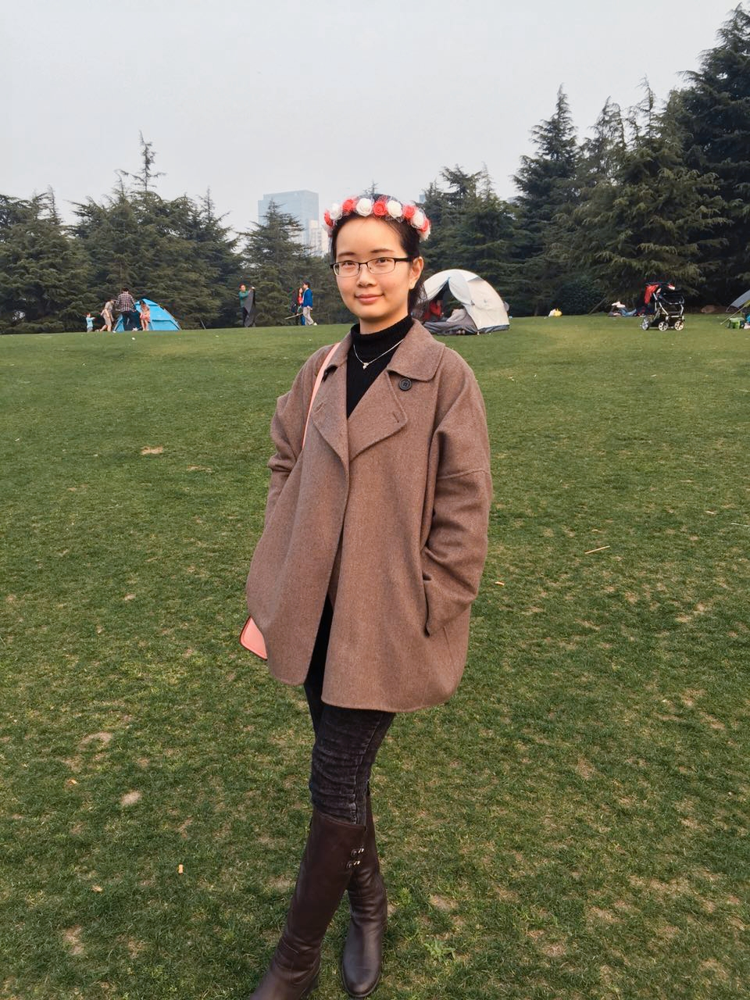</a>
        <figcaption><b>Yuan Liu</b> <b>004-M</b></figcaption>
        </figure>
    

        <figure align="center">
        
        <figcaption><b>Xu Xiang</b> <b>005-UM</b></figcaption>
        </figure>
    

        <figure align="center">
        
        <figcaption><b>Ruihua Sun</b> <b>006-M</b></figcaption>
        </figure>
    

        <figure align="center">
        
        <figcaption><b>Wei Deng</b> <b>007-M</b></figcaption>
        </figure>
    

        <figure align="center">
        
        <figcaption><b>Chunyang Wu</b> <b>008-U</b></figcaption>
        </figure>
    

        <figure align="center">
        
        <figcaption><b>Yongbin You</b> <b>009-UM</b></figcaption>
        </figure>
    

        <figure align="center">
        
        <figcaption><b>Peilu Wang</b> <b>010-MI</b></figcaption>
        </figure>
    

        <figure align="center">
        
        <figcaption><b>Yaxiong Liu</b> <b>012-U</b></figcaption>
        </figure>
    

        <figure align="center">
        
        <figcaption><b>Tian Tan</b> <b>014-UP</b></figcaption>
        </figure>
    

        <figure align="center">
        
        <figcaption><b>Su Zhu</b> <b>015-UP</b></figcaption>
        </figure>
    

        <figure align="center">
        
        <figcaption><b>Guocheng Xie</b> <b>016-U</b></figcaption>
        </figure>
    

        <figure align="center">
        
        <figcaption><b>Tianxing He</b> <b>017-UM</b></figcaption>
        </figure>
    

        <figure align="center">
        
        <figcaption><b>Tianfan Fu</b> <b>018-U</b></figcaption>
        </figure>
    

        <figure align="center">
        <a href="">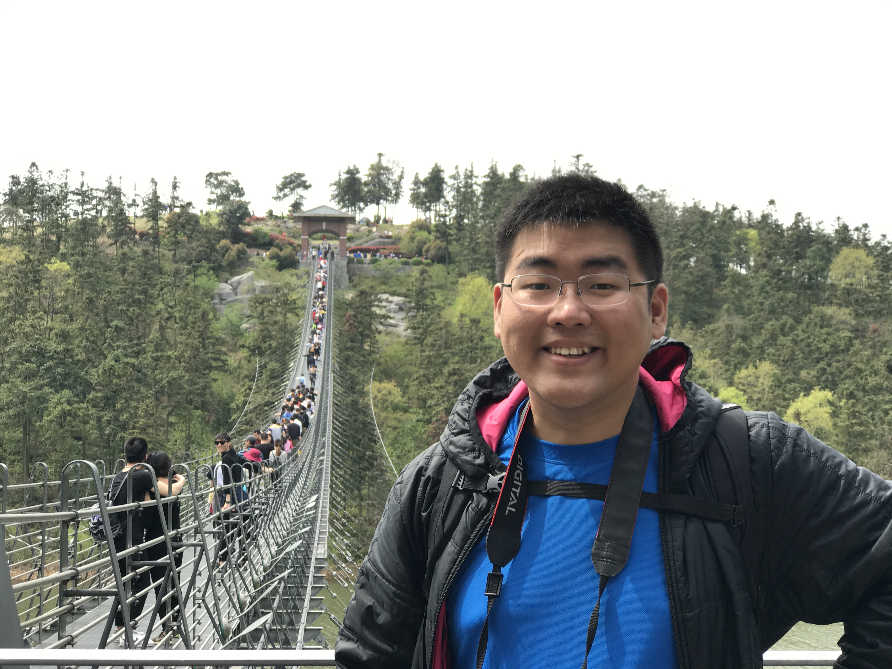</a>
        <figcaption><b>Bo Chen</b> <b>019-P</b></figcaption>
        </figure>
    

        <figure align="center">
        
        <figcaption><b>Kai Sun</b> <b>020-U</b></figcaption>
        </figure>
    

        <figure align="center">
        
        <figcaption><b>Nanxin Chen</b> <b>021-U</b></figcaption>
        </figure>
    

        <figure align="center">
        
        <figcaption><b>Suliang Bo</b> <b>022-I</b></figcaption>
        </figure>
    

        <figure align="center">
        
        <figcaption><b>Sibo Tong</b> <b>023-M</b></figcaption>
        </figure>
    

        <figure align="center">
        
        <figcaption><b>Yi Wan</b> <b>024-U</b></figcaption>
        </figure>
    

        <figure align="center">
        
        <figcaption><b>Da Zheng</b> <b>025-UM</b></figcaption>
        </figure>
    

        <figure align="center">
        
        <figcaption><b>Zhehuai Chen</b> <b>026-UP</b></figcaption>
        </figure>
    

        <figure align="center">
        
        <figcaption><b>Einrich（dinghanlin） H</b> <b>027-MP</b></figcaption>
        </figure>
    

        <figure align="center">
        <a href="">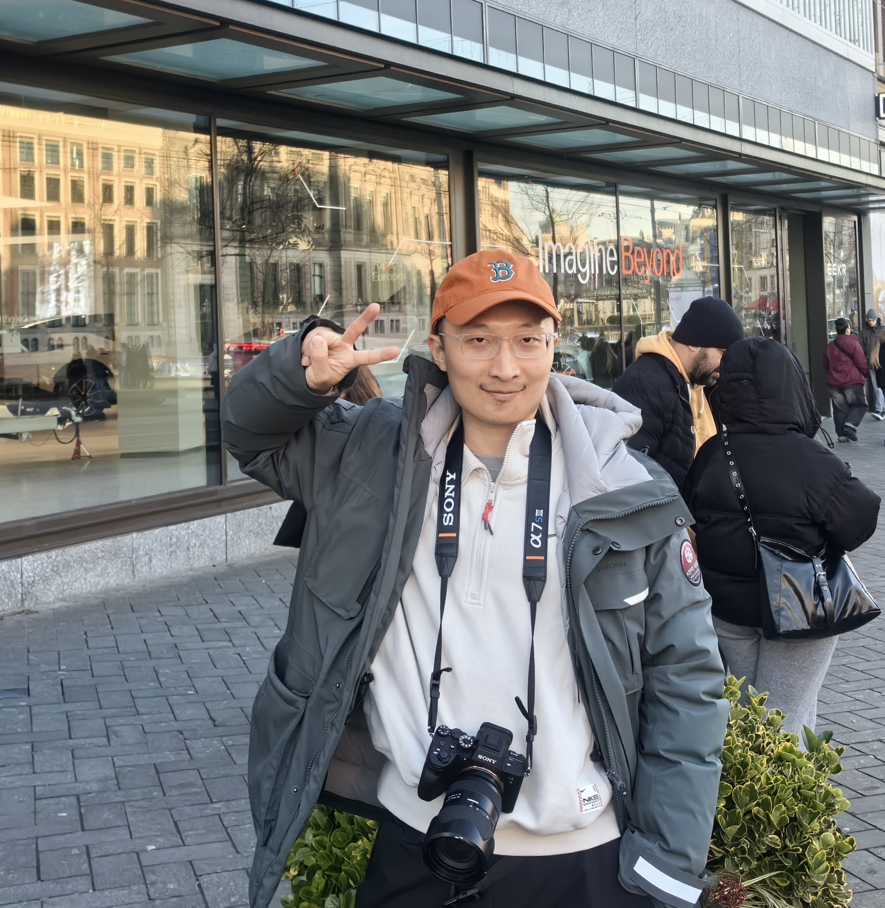</a>
        <figcaption><b>Mengxiao Bi</b> <b>028-M</b></figcaption>
        </figure>
    

        <figure align="center">
        
        <figcaption><b>Libo Shen</b> <b>029-U</b></figcaption>
        </figure>
    

        <figure align="center">
        
        <figcaption><b>Xuankai Chang</b> <b>030-UM</b></figcaption>
        </figure>
    

        <figure align="center">
        
        <figcaption><b>Lingting Ge</b> <b>031-U</b></figcaption>
        </figure>
    

        <figure align="center">
        
        <figcaption><b>Hao Gu</b> <b>032-U</b></figcaption>
        </figure>
    

        <figure align="center">
        
        <figcaption><b>Xingdong Li</b> <b>033-U</b></figcaption>
        </figure>
    

        <figure align="center">
        
        <figcaption><b>Wengong Jin</b> <b>034-U</b></figcaption>
        </figure>
    

        <figure align="center">
        
        <figcaption><b>Qizhe Xie</b> <b>035-U</b></figcaption>
        </figure>
    

        <figure align="center">
        
        <figcaption><b>Maofan Yin</b> <b>036-U</b></figcaption>
        </figure>
    

        <figure align="center">
        
        <figcaption><b>Xiaowei Jiang</b> <b>037-UM</b></figcaption>
        </figure>
    

        <figure align="center">
        
        <figcaption><b>Yimeng Zhuang</b> <b>038-M</b></figcaption>
        </figure>
    

        <figure align="center">
        
        <figcaption><b>Cheng Chang</b> <b>039-UM</b></figcaption>
        </figure>
    

        <figure align="center">
        
        <figcaption><b>Di Cao</b> <b>040-UM</b></figcaption>
        </figure>
    

        <figure align="center">
        
        <figcaption><b>Jiachen Xu</b> <b>041-U</b></figcaption>
        </figure>
    

        <figure align="center">
        
        <figcaption><b>Shuai Wang</b> <b>042-P</b></figcaption>
        </figure>
    

        <figure align="center">
        
        <figcaption><b>Qi Liu</b> <b>043-P</b></figcaption>
        </figure>
    

        <figure align="center">
        
        <figcaption><b>Ke Wu</b> <b>044-F</b></figcaption>
        </figure>
    

        <figure align="center">
        
        <figcaption><b>Yue Wu</b> <b>045-UM</b></figcaption>
        </figure>
    

        <figure align="center">
        
        <figcaption><b>Xueyang Wu</b> <b>046-UP</b></figcaption>
        </figure>
    

        <figure align="center">
        
        <figcaption><b>Xuan Liu</b> <b>047-M</b></figcaption>
        </figure>
    

        <figure align="center">
        
        <figcaption><b>Yuncong Hu</b> <b>048-UP</b></figcaption>
        </figure>
    

        <figure align="center">
        
        <figcaption><b>Hanzheng Li</b> <b>049-U</b></figcaption>
        </figure>
    

        <figure align="center">
        
        <figcaption><b>Siqiu Yao</b> <b>050-U</b></figcaption>
        </figure>
    

        <figure align="center">
        
        <figcaption><b>Jianfei Gao</b> <b>051-U</b></figcaption>
        </figure>
    

        <figure align="center">
        
        <figcaption><b>Jiahao Lai</b> <b>052-M</b></figcaption>
        </figure>
    

        <figure align="center">
        
        <figcaption><b>Ruinian Chen</b> <b>053-UM</b></figcaption>
        </figure>
    

        <figure align="center">
        
        <figcaption><b>Wen Ding</b> <b>054-UM</b></figcaption>
        </figure>
    

        <figure align="center">
        
        <figcaption><b>Ying Zhou</b> <b>055-UM</b></figcaption>
        </figure>
    

        <figure align="center">
        <a href="">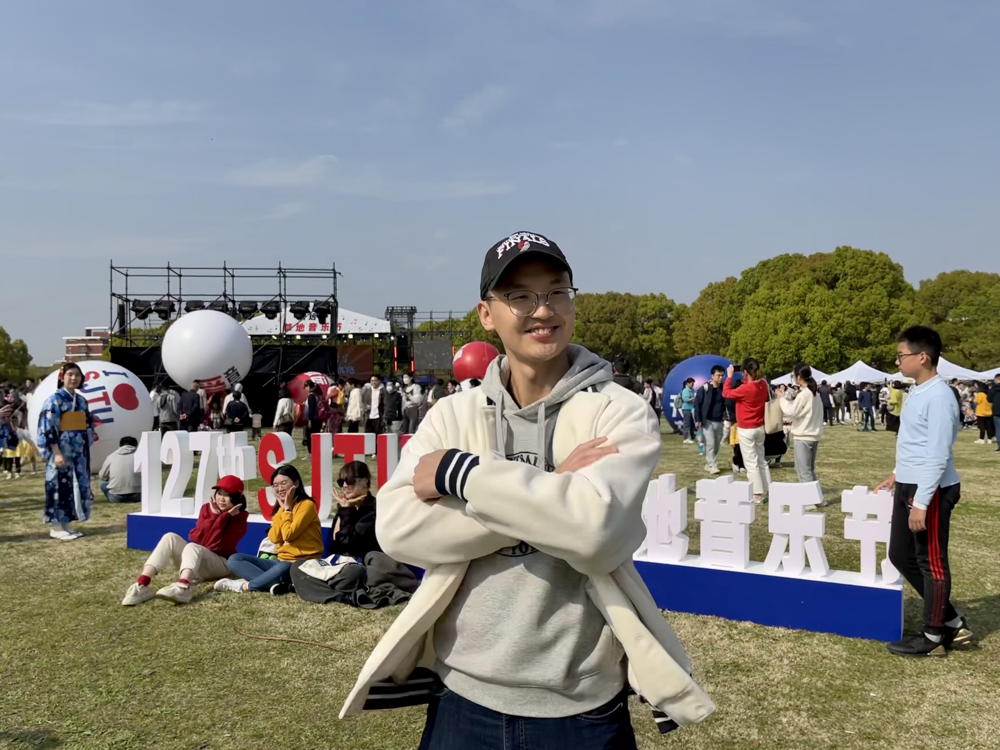</a>
        <figcaption><b>Kaiyu Shi</b> <b>056-UM</b></figcaption>
        </figure>
    

        <figure align="center">
        
        <figcaption><b>Runzhe Yang</b> <b>057-U</b></figcaption>
        </figure>
    

        <figure align="center">
        
        <figcaption><b>Zihao Ye</b> <b>058-U</b></figcaption>
        </figure>
    

        <figure align="center">
        
        <figcaption><b>Huifeng Zhang</b> <b>059-M</b></figcaption>
        </figure>
    

        <figure align="center">
        
        <figcaption><b>Xiang Zhou</b> <b>060-U</b></figcaption>
        </figure>
    

        <figure align="center">
        
        <figcaption><b>Hongtao Lin</b> <b>061-U</b></figcaption>
        </figure>
    

        <figure align="center">
        
        <figcaption><b>Yexin Yang</b> <b>062-UM</b></figcaption>
        </figure>
    

        <figure align="center">
        
        <figcaption><b>Hu Hu</b> <b>063-U</b></figcaption>
        </figure>
    

        <figure align="center">
        
        <figcaption><b>Yefei Chen</b> <b>064-M</b></figcaption>
        </figure>
    

        <figure align="center">
        
        <figcaption><b>Hao Li</b> <b>065-M</b></figcaption>
        </figure>
    

        <figure align="center">
        
        <figcaption><b>Guohang Yin</b> <b>067-U</b></figcaption>
        </figure>
    

        <figure align="center">
        
        <figcaption><b>Zhi Chen</b> <b>068-UP</b></figcaption>
        </figure>
    

        <figure align="center">
        
        <figcaption><b>Kuan Chen</b> <b>069-UM</b></figcaption>
        </figure>
    

        <figure align="center">
        
        <figcaption><b>Mingkun Huang</b> <b>070-M</b></figcaption>
        </figure>
    

        <figure align="center">
        
        <figcaption><b>Jiaqi Guo</b> <b>071-M</b></figcaption>
        </figure>
    

        <figure align="center">
        
        <figcaption><b>Songze Wu</b> <b>072-M</b></figcaption>
        </figure>
    

        <figure align="center">
        
        <figcaption><b>Ouyu Lan</b> <b>074-U</b></figcaption>
        </figure>
    

        <figure align="center">
        
        <figcaption><b>Zili Huang</b> <b>075-U</b></figcaption>
        </figure>
    

        <figure align="center">
        
        <figcaption><b>Chen Liu</b> <b>076-M</b></figcaption>
        </figure>
    

        <figure align="center">
        
        <figcaption><b>Wangyou Zhang</b> <b>077-P</b></figcaption>
        </figure>
    

        <figure align="center">
        
        <figcaption><b>Chenpeng Du</b> <b>078-P</b></figcaption>
        </figure>
    

        <figure align="center">
        
        <figcaption><b>Rao Ma</b> <b>079-M</b></figcaption>
        </figure>
    

        <figure align="center">
        
        <figcaption><b>Chenda Li</b> <b>080-M</b></figcaption>
        </figure>
    

        <figure align="center">
        
        <figcaption><b>Yizhou Lu</b> <b>081-M</b></figcaption>
        </figure>
    

        <figure align="center">
        
        <figcaption><b>Yanbin Zhao</b> <b>082-M</b></figcaption>
        </figure>
    

        <figure align="center">
        
        <figcaption><b>Zhihang Xu</b> <b>083-M</b></figcaption>
        </figure>
    

        <figure align="center">
        
        <figcaption><b>Ruisheng Cao</b> <b>084-MP</b></figcaption>
        </figure>
    

        <figure align="center">
        
        <figcaption><b>Hongji Wang</b> <b>085-M</b></figcaption>
        </figure>
    

        <figure align="center">
        
        <figcaption><b>Kaige Xie</b> <b>086-U</b></figcaption>
        </figure>
    

        <figure align="center">
        
        <figcaption><b>Peiyao Sheng</b> <b>087-U</b></figcaption>
        </figure>
    

        <figure align="center">
        
        <figcaption><b>Sishan Long</b> <b>088-U</b></figcaption>
        </figure>
    

        <figure align="center">
        
        <figcaption><b>Zhuolin Yang</b> <b>089-U</b></figcaption>
        </figure>
    

        <figure align="center">
        
        <figcaption><b>Zhengyang Chen</b> <b>090-P</b></figcaption>
        </figure>
    

        <figure align="center">
        
        <figcaption><b>Jieyu Li</b> <b>092-UM</b></figcaption>
        </figure>
    

        <figure align="center">
        
        <figcaption><b>Xingyu Chen</b> <b>093-M</b></figcaption>
        </figure>
    

        <figure align="center">
        <a href="">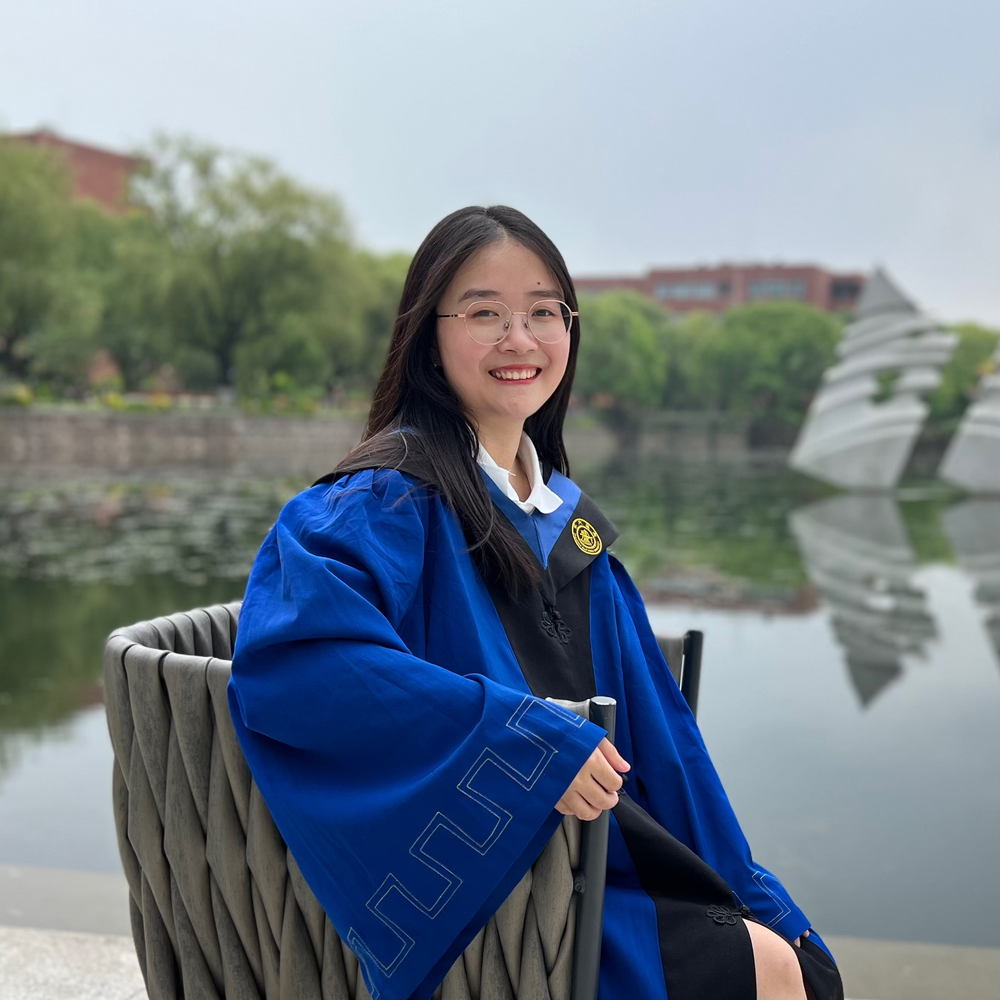</a>
        <figcaption><b>Boer Lv</b> <b>095-M</b></figcaption>
        </figure>
    

        <figure align="center">
        
        <figcaption><b>Bowen Tan</b> <b>096-U</b></figcaption>
        </figure>
    

        <figure align="center">
        
        <figcaption><b>Yao Zhao</b> <b>097-M</b></figcaption>
        </figure>
    

        <figure align="center">
        
        <figcaption><b>Zhikai Zhou</b> <b>099-M</b></figcaption>
        </figure>
    

        <figure align="center">
        
        <figcaption><b>Wei Wang</b> <b>100-M</b></figcaption>
        </figure>
    

        <figure align="center">
        
        <figcaption><b>Zhanghao Wu</b> <b>101-U</b></figcaption>
        </figure>
    

        <figure align="center">
        
        <figcaption><b>Tianzhe Wang</b> <b>102-U</b></figcaption>
        </figure>
    

        <figure align="center">
        
        <figcaption><b>Zhijun Liu</b> <b>103-UM</b></figcaption>
        </figure>
    

        <figure align="center">
        
        <figcaption><b>Pingyue Zhang</b> <b>104-U</b></figcaption>
        </figure>
    

        <figure align="center">
        <a href="">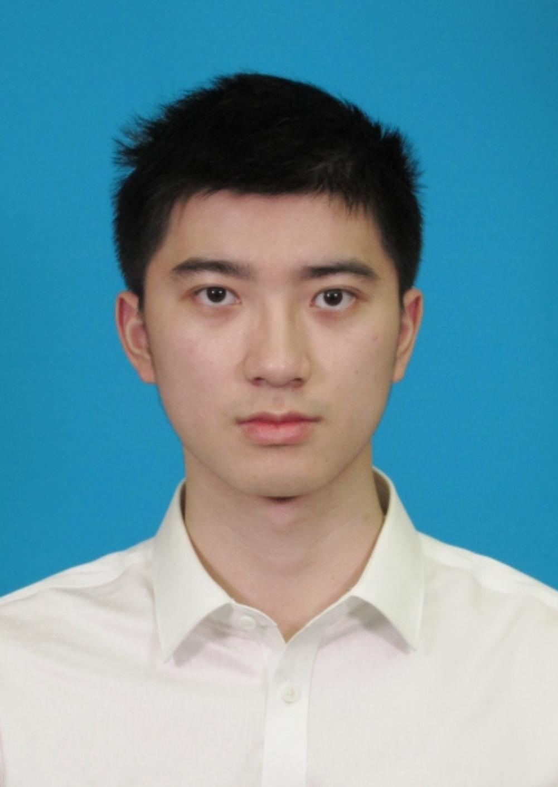</a>
        <figcaption><b>Zihan Xu</b> <b>105-U</b></figcaption>
        </figure>
    

        <figure align="center">
        <a href="">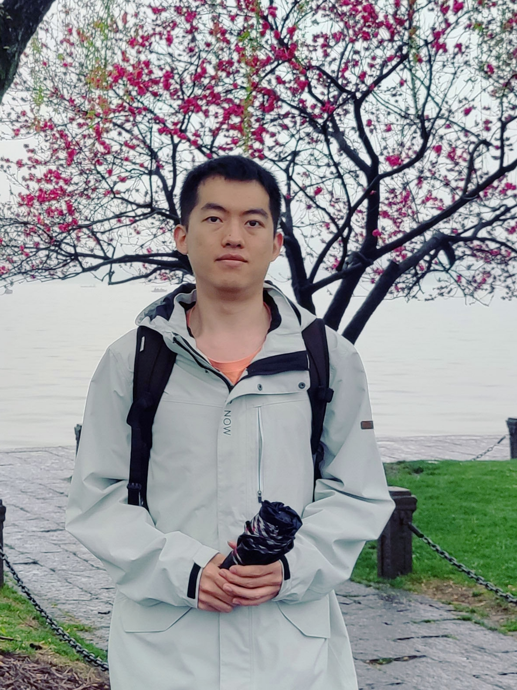</a>
        <figcaption><b>Yifei Wu</b> <b>108-M</b></figcaption>
        </figure>
    

        <figure align="center">
        
        <figcaption><b>Bing Han</b> <b>109-M</b></figcaption>
        </figure>
    

        <figure align="center">
        
        <figcaption><b>Guangwei Li</b> <b>110-M</b></figcaption>
        </figure>
    

        <figure align="center">
        
        <figcaption><b>Lingfeng Dai</b> <b>111-M</b></figcaption>
        </figure>
    

        <figure align="center">
        
        <figcaption><b>Fei Jiang</b> <b>114-F</b></figcaption>
        </figure>
    

        <figure align="center">
        
        <figcaption><b>Yi Yang</b> <b>115-P</b></figcaption>
        </figure>
    

        <figure align="center">
        
        <figcaption><b>Qiaoping Hu</b> <b>116-P</b></figcaption>
        </figure>
    

        <figure align="center">
        
        <figcaption><b>Huayi Zhou</b> <b>117-MP</b></figcaption>
        </figure>
    

        <figure align="center">
        
        <figcaption><b>Jiaxin Si</b> <b>118-P</b></figcaption>
        </figure>
    

        <figure align="center">
        
        <figcaption><b>Xiang Xiao</b> <b>119-M</b></figcaption>
        </figure>
    

        <figure align="center">
        
        <figcaption><b>Zeda Li</b> <b>120-M</b></figcaption>
        </figure>
    

        <figure align="center">
        
        <figcaption><b>Tian Yu</b> <b>121-M</b></figcaption>
        </figure>
    

        <figure align="center">
        
        <figcaption><b>Yanrong Wu</b> <b>122-M</b></figcaption>
        </figure>
    

        <figure align="center">
        
        <figcaption><b>Haoze Yang</b> <b>123-M</b></figcaption>
        </figure>
    

        <figure align="center">
        
        <figcaption><b>Jisen Chen</b> <b>124-M</b></figcaption>
        </figure>
    

        <figure align="center">
        
        <figcaption><b>Wenbin Jiang</b> <b>125-F</b></figcaption>
        </figure>
    

        <figure align="center">
        
        <figcaption><b>Zheng Liang</b> <b>126-M</b></figcaption>
        </figure>
    

        <figure align="center">
        
        <figcaption><b>Linfeng Yu</b> <b>127-M</b></figcaption>
        </figure>
    

        <figure align="center">
        
        <figcaption><b>Hang Shao</b> <b>128-M</b></figcaption>
        </figure>
    

        <figure align="center">
        
        <figcaption><b>Xun Gong</b> <b>130-P</b></figcaption>
        </figure>
    

        <figure align="center">
        
        <figcaption><b>Chunhui Li</b> <b>132-M</b></figcaption>
        </figure>
    

        <figure align="center">
        
        <figcaption><b>Yuncong Liu</b> <b>133-P</b></figcaption>
        </figure>
    

        <figure align="center">
        <a href="">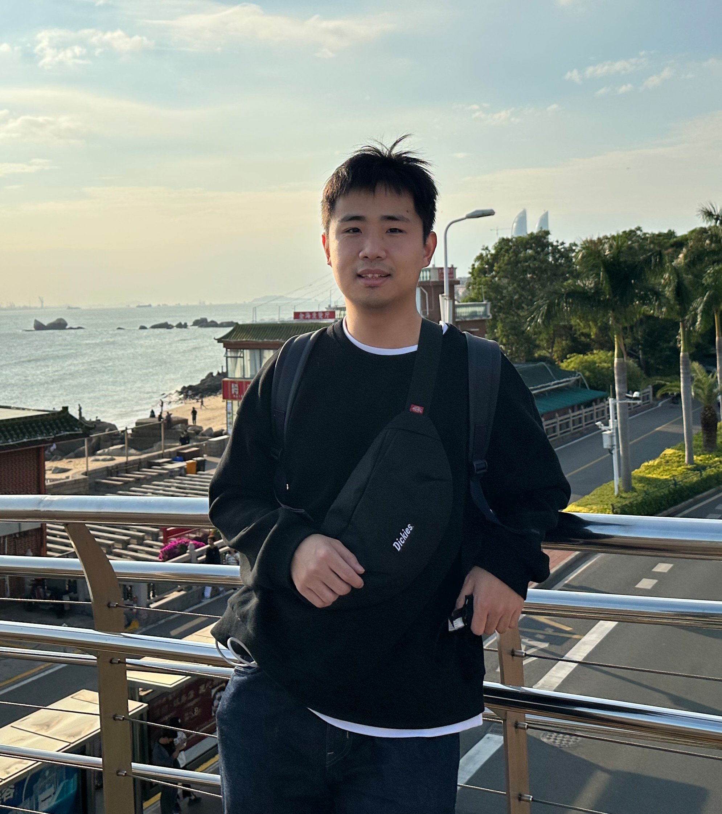</a>
        <figcaption><b>Sen Liu</b> <b>134-M</b></figcaption>
        </figure>
    

        <figure align="center">
        
        <figcaption><b>Guangpeng Li</b> <b>135-M</b></figcaption>
        </figure>
    

        <figure align="center">
        
        <figcaption><b>Baochen Yang</b> <b>136-M</b></figcaption>
        </figure>
    

        <figure align="center">
        
        <figcaption><b>Zeyu Xie</b> <b>138-UM</b></figcaption>
        </figure>
    

        <figure align="center">
        
        <figcaption><b>Siyuan Chen</b> <b>149-M</b></figcaption>
        </figure>
    

        <figure align="center">
        
        <figcaption><b>Zheshu Song</b> <b>154-M</b></figcaption>
        </figure>
    

        <figure align="center">
        
        <figcaption><b>Chunhao Zhang</b> <b>155-M</b></figcaption>
        </figure>
    

        <figure align="center">
        
        <figcaption><b>Hanchong Zhang</b> <b>165-M</b></figcaption>
        </figure>
    

        <figure align="center">
        
        <figcaption><b>Jingpiao Li</b> <b>168-M</b></figcaption>
        </figure>
    

        <figure align="center">
        <a href="">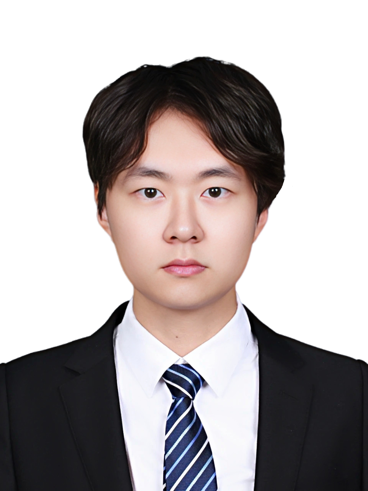</a>
        <figcaption><b>Liangtai Sun</b> <b>170-M</b></figcaption>
        </figure>
    

        <figure align="center">
        
        <figcaption><b>Chaofan He</b> <b>172-M</b></figcaption>
        </figure>
    

        <figure align="center">
        
        <figcaption><b>Hongchuan Ceng</b> <b>176-M</b></figcaption>
        </figure>
    

        <figure align="center">
        <a href="">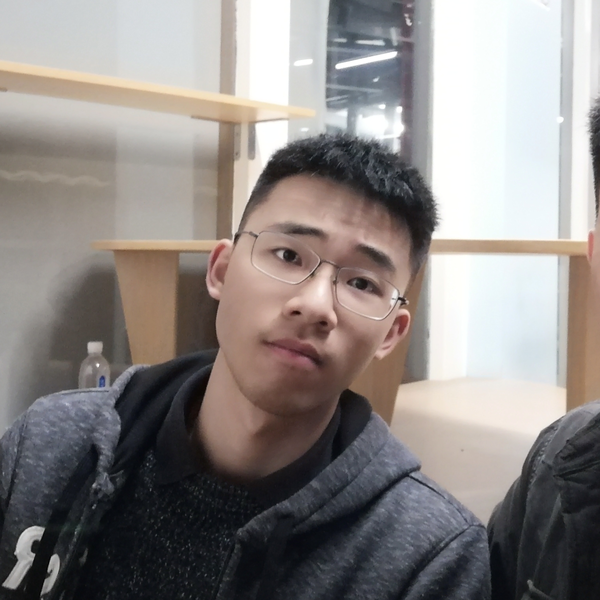</a>
        <figcaption><b>Feiyu Shen</b> <b>179-M</b></figcaption>
        </figure>
    

        <figure align="center">
        
        <figcaption><b>Ao Luo</b> <b>180-U</b></figcaption>
        </figure>
    

        <figure align="center">
        
        <figcaption><b>Jiabao Ji</b> <b>181-U</b></figcaption>
        </figure>
    

        <figure align="center">
        <a href="">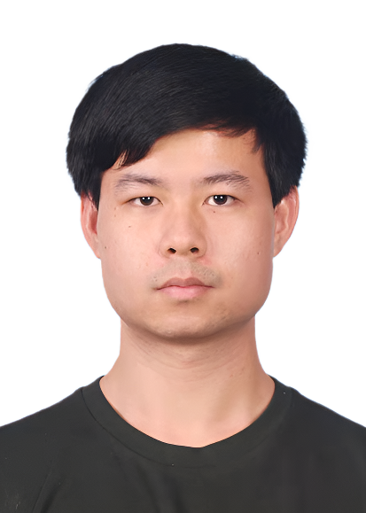</a>
        <figcaption><b>Shaoxiong Lin</b> <b>182-M</b></figcaption>
        </figure>
    

        <figure align="center">
        
        <figcaption><b>Liliang Ren</b> <b>184-U</b></figcaption>
        </figure>
    

        <figure align="center">
        <a href="">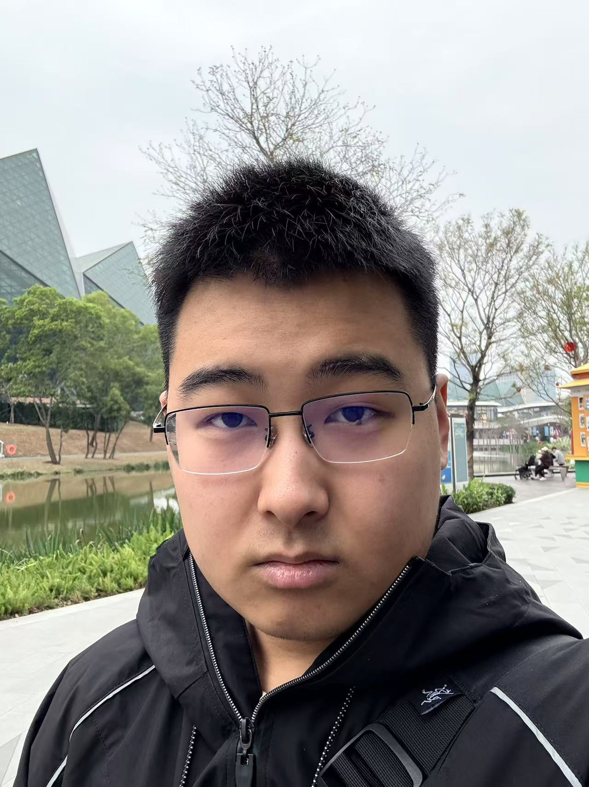</a>
        <figcaption><b>Ziyuan Li</b> <b>191-U</b></figcaption>
        </figure>
    

        <figure align="center">
        
        <figcaption><b>Zhihan Li</b> <b>198-M</b></figcaption>
        </figure>
    

        <figure align="center">
        
        <figcaption><b>Yitian Zhang</b> <b>199-M</b></figcaption>
        </figure>
    

        <figure align="center">
        
        <figcaption><b>Guohang Yin</b> <b></b></figcaption>
        </figure>
    
