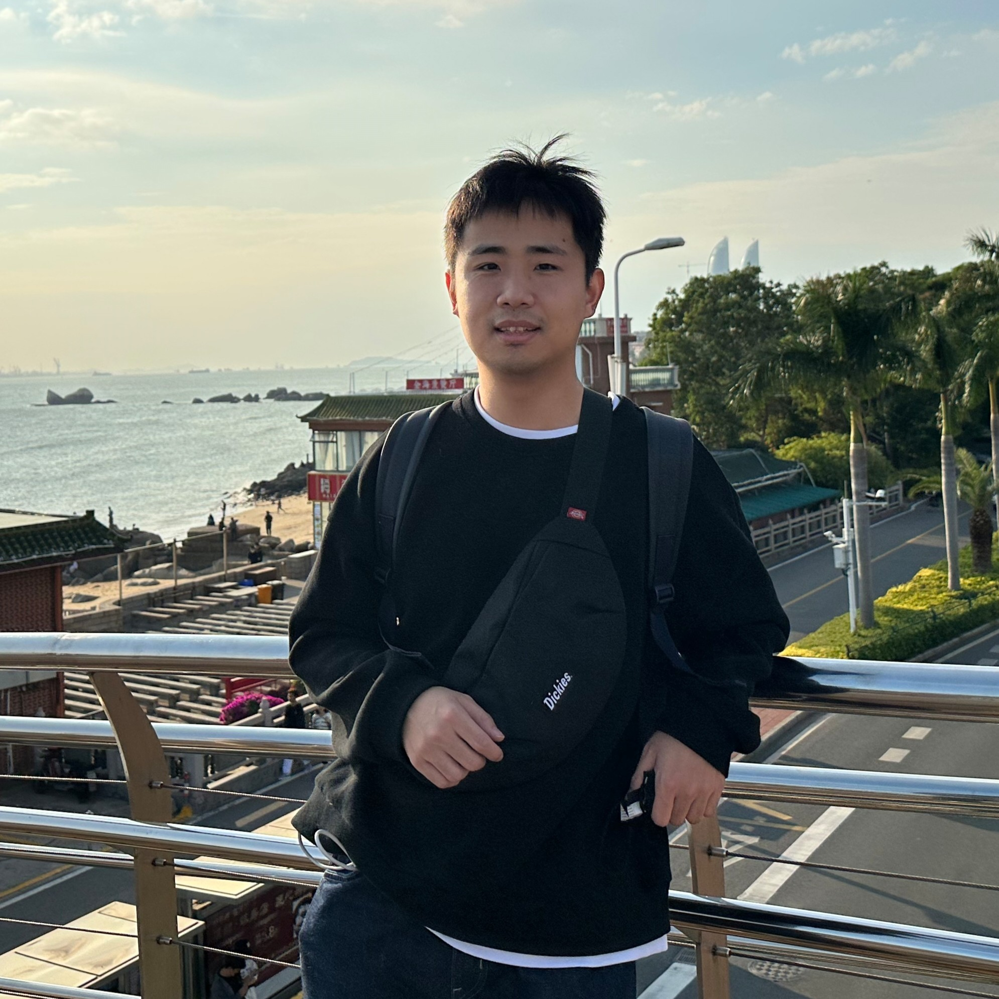

[//]: # (<h2> 博士后 </h2>)

        <figure align="center">
        
        <figcaption><b>Hainan Xu</b> <b>2-U</b></figcaption>
        </figure>
    

        <figure align="center">
        
        <figcaption><b>Yuchen Fan</b> <b>3-U</b></figcaption>
        </figure>
    

        <figure align="center">
        
        <figcaption><b>Yuan Liu</b> <b>4-M</b></figcaption>
        </figure>
    

        <figure align="center">
        
        <figcaption><b>Xu Xiang</b> <b>5-UM</b></figcaption>
        </figure>
    

        <figure align="center">
        
        <figcaption><b>Ruihua Sun</b> <b>6-M</b></figcaption>
        </figure>
    

        <figure align="center">
        
        <figcaption><b>Wei Deng</b> <b>7-M</b></figcaption>
        </figure>
    

        <figure align="center">
        
        <figcaption><b>Chunyang Wu</b> <b>8-U</b></figcaption>
        </figure>
    

        <figure align="center">
        
        <figcaption><b>Yongbin You</b> <b>9-UM</b></figcaption>
        </figure>
    

        <figure align="center">
        
        <figcaption><b>Peilu Wang</b> <b>10-IM</b></figcaption>
        </figure>
    

        <figure align="center">
        
        <figcaption><b>Yaxiong Liu</b> <b>12-U</b></figcaption>
        </figure>
    

        <figure align="center">
        
        <figcaption><b>Tian Tan</b> <b>14-UP</b></figcaption>
        </figure>
    

        <figure align="center">
        
        <figcaption><b>Su Zhu</b> <b>15-UP</b></figcaption>
        </figure>
    

        <figure align="center">
        
        <figcaption><b>Guocheng Xie</b> <b>16-U</b></figcaption>
        </figure>
    

        <figure align="center">
        
        <figcaption><b>Tianxing He</b> <b>17-UM</b></figcaption>
        </figure>
    

        <figure align="center">
        
        <figcaption><b>Tianfan Fu</b> <b>18-U</b></figcaption>
        </figure>
    

        <figure align="center">
        
        <figcaption><b>Bo Chen</b> <b>19-P</b></figcaption>
        </figure>
    

        <figure align="center">
        
        <figcaption><b>Kai Sun</b> <b>20-U</b></figcaption>
        </figure>
    

        <figure align="center">
        
        <figcaption><b>Nanxin Chen</b> <b>21-U</b></figcaption>
        </figure>
    

        <figure align="center">
        
        <figcaption><b>Suliang Bo</b> <b>22-I</b></figcaption>
        </figure>
    

        <figure align="center">
        
        <figcaption><b>Sibo Tong</b> <b>23-M</b></figcaption>
        </figure>
    

        <figure align="center">
        
        <figcaption><b>Yi Wan</b> <b>24-U</b></figcaption>
        </figure>
    

        <figure align="center">
        
        <figcaption><b>Da Zheng</b> <b>25-UM</b></figcaption>
        </figure>
    

        <figure align="center">
        
        <figcaption><b>Zhehuai Chen</b> <b>26-UP</b></figcaption>
        </figure>
    

        <figure align="center">
        
        <figcaption><b>Einrich（dinghanlin） H</b> <b>27-MP</b></figcaption>
        </figure>
    

        <figure align="center">
        
        <figcaption><b>Mengxiao Bi</b> <b>28-M</b></figcaption>
        </figure>
    

        <figure align="center">
        
        <figcaption><b>Libo Shen</b> <b>29-U</b></figcaption>
        </figure>
    

        <figure align="center">
        
        <figcaption><b>Xuankai Chang</b> <b>30-UM</b></figcaption>
        </figure>
    

        <figure align="center">
        
        <figcaption><b>Lingting Ge</b> <b>31-U</b></figcaption>
        </figure>
    

        <figure align="center">
        
        <figcaption><b>Hao Gu</b> <b>32-U</b></figcaption>
        </figure>
    

        <figure align="center">
        
        <figcaption><b>Xingdong Li</b> <b>33-U</b></figcaption>
        </figure>
    

        <figure align="center">
        
        <figcaption><b>Wengong Jin</b> <b>34-U</b></figcaption>
        </figure>
    

        <figure align="center">
        
        <figcaption><b>Qizhe Xie</b> <b>35-U</b></figcaption>
        </figure>
    

        <figure align="center">
        
        <figcaption><b>Maofan Yin</b> <b>36-U</b></figcaption>
        </figure>
    

        <figure align="center">
        
        <figcaption><b>Xiaowei Jiang</b> <b>37-UM</b></figcaption>
        </figure>
    

        <figure align="center">
        
        <figcaption><b>Yimeng Zhuang</b> <b>38-M</b></figcaption>
        </figure>
    

        <figure align="center">
        
        <figcaption><b>Cheng Chang</b> <b>39-UM</b></figcaption>
        </figure>
    

        <figure align="center">
        
        <figcaption><b>Di Cao</b> <b>40-UM</b></figcaption>
        </figure>
    

        <figure align="center">
        
        <figcaption><b>Jiachen Xu</b> <b>41-U</b></figcaption>
        </figure>
    

        <figure align="center">
        
        <figcaption><b>Shuai Wang</b> <b>42-P</b></figcaption>
        </figure>
    

        <figure align="center">
        
        <figcaption><b>Qi Liu</b> <b>43-P</b></figcaption>
        </figure>
    

        <figure align="center">
        
        <figcaption><b>Ke Wu</b> <b>44-F</b></figcaption>
        </figure>
    

        <figure align="center">
        
        <figcaption><b>Yue Wu</b> <b>45-UM</b></figcaption>
        </figure>
    

        <figure align="center">
        
        <figcaption><b>Xueyang Wu</b> <b>46-UP</b></figcaption>
        </figure>
    

        <figure align="center">
        
        <figcaption><b>Xuan Liu</b> <b>47-M</b></figcaption>
        </figure>
    

        <figure align="center">
        
        <figcaption><b>Yuncong Hu</b> <b>48-UP</b></figcaption>
        </figure>
    

        <figure align="center">
        
        <figcaption><b>Hanzheng Li</b> <b>49-U</b></figcaption>
        </figure>
    

        <figure align="center">
        
        <figcaption><b>Siqiu Yao</b> <b>50-U</b></figcaption>
        </figure>
    

        <figure align="center">
        
        <figcaption><b>Jianfei Gao</b> <b>51-U</b></figcaption>
        </figure>
    

        <figure align="center">
        
        <figcaption><b>Jiahao Lai</b> <b>52-M</b></figcaption>
        </figure>
    

        <figure align="center">
        
        <figcaption><b>Ruinian Chen</b> <b>53-UM</b></figcaption>
        </figure>
    

        <figure align="center">
        
        <figcaption><b>Wen Ding</b> <b>54-UM</b></figcaption>
        </figure>
    

        <figure align="center">
        
        <figcaption><b>Ying Zhou</b> <b>55-UM</b></figcaption>
        </figure>
    

        <figure align="center">
        
        <figcaption><b>Kaiyu Shi</b> <b>56-UM</b></figcaption>
        </figure>
    

        <figure align="center">
        
        <figcaption><b>Runzhe Yang</b> <b>57-U</b></figcaption>
        </figure>
    

        <figure align="center">
        
        <figcaption><b>Zihao Ye</b> <b>58-U</b></figcaption>
        </figure>
    

        <figure align="center">
        
        <figcaption><b>Huifeng Zhang</b> <b>59-M</b></figcaption>
        </figure>
    

        <figure align="center">
        
        <figcaption><b>Xiang Zhou</b> <b>60-U</b></figcaption>
        </figure>
    

        <figure align="center">
        
        <figcaption><b>Hongtao Lin</b> <b>61-U</b></figcaption>
        </figure>
    

        <figure align="center">
        
        <figcaption><b>Yexin Yang</b> <b>62-UM</b></figcaption>
        </figure>
    

        <figure align="center">
        
        <figcaption><b>Hu Hu</b> <b>63-U</b></figcaption>
        </figure>
    

        <figure align="center">
        
        <figcaption><b>Yefei Chen</b> <b>64-M</b></figcaption>
        </figure>
    

        <figure align="center">
        
        <figcaption><b>Hao Li</b> <b>65-M</b></figcaption>
        </figure>
    

        <figure align="center">
        
        <figcaption><b>Zijian Zhao</b> <b>66-M</b></figcaption>
        </figure>
    

        <figure align="center">
        
        <figcaption><b>Guohang Yin</b> <b>67-U</b></figcaption>
        </figure>
    

        <figure align="center">
        
        <figcaption><b>Zhi Chen</b> <b>68-UP</b></figcaption>
        </figure>
    

        <figure align="center">
        
        <figcaption><b>Kuan Chen</b> <b>69-UM</b></figcaption>
        </figure>
    

        <figure align="center">
        
        <figcaption><b>Mingkun Huang</b> <b>70-M</b></figcaption>
        </figure>
    

        <figure align="center">
        
        <figcaption><b>Jiaqi Guo</b> <b>71-M</b></figcaption>
        </figure>
    

        <figure align="center">
        
        <figcaption><b>Songze Wu</b> <b>72-M</b></figcaption>
        </figure>
    

        <figure align="center">
        
        <figcaption><b>Ouyu Lan</b> <b>74-U</b></figcaption>
        </figure>
    

        <figure align="center">
        
        <figcaption><b>Zili Huang</b> <b>75-U</b></figcaption>
        </figure>
    

        <figure align="center">
        
        <figcaption><b>Chen Liu</b> <b>76-M</b></figcaption>
        </figure>
    

        <figure align="center">
        
        <figcaption><b>Wangyou Zhang</b> <b>77-P</b></figcaption>
        </figure>
    

        <figure align="center">
        
        <figcaption><b>Chenpeng Du</b> <b>78-P</b></figcaption>
        </figure>
    

        <figure align="center">
        
        <figcaption><b>Rao Ma</b> <b>79-M</b></figcaption>
        </figure>
    

        <figure align="center">
        
        <figcaption><b>Chenda Li</b> <b>80-M</b></figcaption>
        </figure>
    

        <figure align="center">
        
        <figcaption><b>Yizhou Lu</b> <b>81-M</b></figcaption>
        </figure>
    

        <figure align="center">
        
        <figcaption><b>Yanbin Zhao</b> <b>82-M</b></figcaption>
        </figure>
    

        <figure align="center">
        
        <figcaption><b>Zhihang Xu</b> <b>83-M</b></figcaption>
        </figure>
    

        <figure align="center">
        
        <figcaption><b>Hongji Wang</b> <b>85-M</b></figcaption>
        </figure>
    

        <figure align="center">
        
        <figcaption><b>Kaige Xie</b> <b>86-U</b></figcaption>
        </figure>
    

        <figure align="center">
        
        <figcaption><b>Peiyao Sheng</b> <b>87-U</b></figcaption>
        </figure>
    

        <figure align="center">
        
        <figcaption><b>Sishan Long</b> <b>88-U</b></figcaption>
        </figure>
    

        <figure align="center">
        
        <figcaption><b>Zhuolin Yang</b> <b>89-U</b></figcaption>
        </figure>
    

        <figure align="center">
        
        <figcaption><b>Zhengyang Chen</b> <b>90-P</b></figcaption>
        </figure>
    

        <figure align="center">
        
        <figcaption><b>Jieyu Li</b> <b>92-UM</b></figcaption>
        </figure>
    

        <figure align="center">
        
        <figcaption><b>Xingyu Chen</b> <b>93-M</b></figcaption>
        </figure>
    

        <figure align="center">
        
        <figcaption><b>Boer Lv</b> <b>95-M</b></figcaption>
        </figure>
    

        <figure align="center">
        
        <figcaption><b>Bowen Tan</b> <b>96-U</b></figcaption>
        </figure>
    

        <figure align="center">
        
        <figcaption><b>Yao Zhao</b> <b>97-M</b></figcaption>
        </figure>
    

        <figure align="center">
        
        <figcaption><b>Zhikai Zhou</b> <b>99-M</b></figcaption>
        </figure>
    

        <figure align="center">
        
        <figcaption><b>Wei Wang</b> <b>100-M</b></figcaption>
        </figure>
    

        <figure align="center">
        
        <figcaption><b>Zhanghao Wu</b> <b>101-U</b></figcaption>
        </figure>
    

        <figure align="center">
        
        <figcaption><b>Tianzhe Wang</b> <b>102-U</b></figcaption>
        </figure>
    

        <figure align="center">
        
        <figcaption><b>Zhijun Liu</b> <b>103-UM</b></figcaption>
        </figure>
    

        <figure align="center">
        
        <figcaption><b>Pingyue Zhang</b> <b>104-U</b></figcaption>
        </figure>
    

        <figure align="center">
        
        <figcaption><b>Zihan Xu</b> <b>105-U</b></figcaption>
        </figure>
    

        <figure align="center">
        
        <figcaption><b>Yifei Wu</b> <b>108-M</b></figcaption>
        </figure>
    

        <figure align="center">
        
        <figcaption><b>Bing Han</b> <b>109-M</b></figcaption>
        </figure>
    

        <figure align="center">
        
        <figcaption><b>Guangwei Li</b> <b>110-M</b></figcaption>
        </figure>
    

        <figure align="center">
        
        <figcaption><b>Lingfeng Dai</b> <b>111-M</b></figcaption>
        </figure>
    

        <figure align="center">
        
        <figcaption><b>Fei Jiang</b> <b>114-F</b></figcaption>
        </figure>
    

        <figure align="center">
        
        <figcaption><b>Yi Yang</b> <b>115-P</b></figcaption>
        </figure>
    

        <figure align="center">
        
        <figcaption><b>Qiaoping Hu</b> <b>116-P</b></figcaption>
        </figure>
    

        <figure align="center">
        
        <figcaption><b>Huayi Zhou</b> <b>117-MP</b></figcaption>
        </figure>
    

        <figure align="center">
        
        <figcaption><b>Jiaxin Si</b> <b>118-P</b></figcaption>
        </figure>
    

        <figure align="center">
        
        <figcaption><b>Xiang Xiao</b> <b>119-M</b></figcaption>
        </figure>
    

        <figure align="center">
        
        <figcaption><b>Zeda Li</b> <b>120-M</b></figcaption>
        </figure>
    

        <figure align="center">
        
        <figcaption><b>Tian Yu</b> <b>121-M</b></figcaption>
        </figure>
    

        <figure align="center">
        
        <figcaption><b>Yanrong Wu</b> <b>122-M</b></figcaption>
        </figure>
    

        <figure align="center">
        
        <figcaption><b>Haoze Yang</b> <b>123-M</b></figcaption>
        </figure>
    

        <figure align="center">
        
        <figcaption><b>Jisen Chen</b> <b>124-M</b></figcaption>
        </figure>
    

        <figure align="center">
        
        <figcaption><b>Wenbin Jiang</b> <b>125-F</b></figcaption>
        </figure>
    

        <figure align="center">
        
        <figcaption><b>Zheng Liang</b> <b>126-M</b></figcaption>
        </figure>
    

        <figure align="center">
        
        <figcaption><b>Linfeng Yu</b> <b>127-M</b></figcaption>
        </figure>
    

        <figure align="center">
        
        <figcaption><b>Hang Shao</b> <b>128-M</b></figcaption>
        </figure>
    

        <figure align="center">
        
        <figcaption><b>Xun Gong</b> <b>130-P</b></figcaption>
        </figure>
    

        <figure align="center">
        
        <figcaption><b>Chunhui Li</b> <b>132-M</b></figcaption>
        </figure>
    

        <figure align="center">
        
        <figcaption><b>Yuncong Liu</b> <b>133-P</b></figcaption>
        </figure>
    

        <figure align="center">
        
        <figcaption><b>Sen Liu</b> <b>134-M</b></figcaption>
        </figure>
    

        <figure align="center">
        
        <figcaption><b>Guangpeng Li</b> <b>135-M</b></figcaption>
        </figure>
    

        <figure align="center">
        
        <figcaption><b>Baochen Yang</b> <b>136-M</b></figcaption>
        </figure>
    

        <figure align="center">
        
        <figcaption><b>Zeyu Xie</b> <b>138-U</b></figcaption>
        </figure>
    

        <figure align="center">
        
        <figcaption><b>Siyuan Chen</b> <b>149-M</b></figcaption>
        </figure>
    

        <figure align="center">
        
        <figcaption><b>Zheshu Song</b> <b>154-M</b></figcaption>
        </figure>
    

        <figure align="center">
        
        <figcaption><b>Chunhao Zhang</b> <b>155-M</b></figcaption>
        </figure>
    

        <figure align="center">
        
        <figcaption><b>Hanchong Zhang</b> <b>165-M</b></figcaption>
        </figure>
    

        <figure align="center">
        
        <figcaption><b>Jingpiao Li</b> <b>168-M</b></figcaption>
        </figure>
    

        <figure align="center">
        
        <figcaption><b>Liangtai Sun</b> <b>170-M</b></figcaption>
        </figure>
    

        <figure align="center">
        
        <figcaption><b>Chaofan He</b> <b>172-M</b></figcaption>
        </figure>
    

        <figure align="center">
        
        <figcaption><b>Hongchuan Ceng</b> <b>176-M</b></figcaption>
        </figure>
    

        <figure align="center">
        
        <figcaption><b>Hongchuan Ceng</b> <b>176-M</b></figcaption>
        </figure>
    

        <figure align="center">
        
        <figcaption><b>Feiyu Shen</b> <b>179-M</b></figcaption>
        </figure>
    

        <figure align="center">
        
        <figcaption><b>Ao Luo</b> <b>180-U</b></figcaption>
        </figure>
    

        <figure align="center">
        
        <figcaption><b>Jiabao Ji</b> <b>181-U</b></figcaption>
        </figure>
    

        <figure align="center">
        
        <figcaption><b>Shaoxiong Lin</b> <b>182-M</b></figcaption>
        </figure>
    
