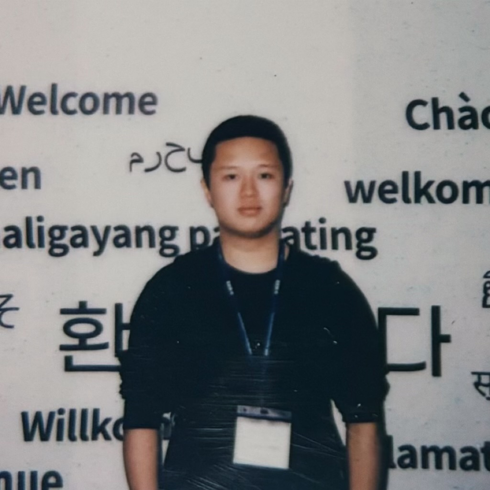

[//]: # (<h2> Postdocs </h2>)
<h2> PhD Candidates </h2>

        <figure align="center">
        
        <figcaption><b>Ruisheng Cao</b> <b>84-MP</b></figcaption>
        </figure>
    

        <figure align="center">
        
        <figcaption><b>Hongshen Xu</b> <b>91-P</b></figcaption>
        </figure>
    

        <figure align="center">
        
        <figcaption><b>Xuenan Xu</b> <b>98-MP</b></figcaption>
        </figure>
    

        <figure align="center">
        
        <figcaption><b>Zihan Zhao</b> <b>106-P</b></figcaption>
        </figure>
    

        <figure align="center">
        
        <figcaption><b>Yu Xi</b> <b>107-P</b></figcaption>
        </figure>
    

        <figure align="center">
        
        <figcaption><b>Danyang Zhang</b> <b>112-P</b></figcaption>
        </figure>
    

        <figure align="center">
        
        <figcaption><b>Tao Liu</b> <b>129-P</b></figcaption>
        </figure>
    

        <figure align="center">
        
        <figcaption><b>Situo Zhang</b> <b>140-P</b></figcaption>
        </figure>
    

        <figure align="center">
        
        <figcaption><b>Pengyu Wang</b> <b>145-P</b></figcaption>
        </figure>
    

        <figure align="center">
        
        <figcaption><b>Zichen Zhu</b> <b>146-P</b></figcaption>
        </figure>
    

        <figure align="center">
        
        <figcaption><b>Jiaming Luo</b> <b>147-P</b></figcaption>
        </figure>
    

        <figure align="center">
        
        <figcaption><b>Hankun Wang</b> <b>150-P</b></figcaption>
        </figure>
    

        <figure align="center">
        
        <figcaption><b>Ziyang Ma</b> <b>151-P</b></figcaption>
        </figure>
    

        <figure align="center">
        
        <figcaption><b>Guanrou Yang</b> <b>153-MP</b></figcaption>
        </figure>
    

        <figure align="center">
        
        <figcaption><b>Yiwei Guo</b> <b>158-P</b></figcaption>
        </figure>
    

        <figure align="center">
        
        <figcaption><b>Junzhe Liu</b> <b>160-P</b></figcaption>
        </figure>
    

        <figure align="center">
        
        <figcaption><b>Xiujie Song</b> <b>164-P</b></figcaption>
        </figure>
    

        <figure align="center">
        
        <figcaption><b>Yang Han</b> <b>166-P</b></figcaption>
        </figure>
    

        <figure align="center">
        
        <figcaption><b>Yifan Yang</b> <b>171-P</b></figcaption>
        </figure>
    

        <figure align="center">
        
        <figcaption><b>Zhikang Niu</b> <b>177-P</b></figcaption>
        </figure>
    

<h2> Master Candidates </h2>

        <figure align="center">
        
        <figcaption><b>Da Ma</b> <b>94-M</b></figcaption>
        </figure>
    

        <figure align="center">
        
        <figcaption><b>Kunyao Lan</b> <b>131-M</b></figcaption>
        </figure>
    

        <figure align="center">
        
        <figcaption><b>Xiaohang Xu</b> <b>139-M</b></figcaption>
        </figure>
    

        <figure align="center">
        
        <figcaption><b>Gewei Lu</b> <b>143-M</b></figcaption>
        </figure>
    

        <figure align="center">
        
        <figcaption><b>Danyu Luo</b> <b>144-M</b></figcaption>
        </figure>
    

        <figure align="center">
        
        <figcaption><b>Jianheng Zhuo</b> <b>148-M</b></figcaption>
        </figure>
    

        <figure align="center">
        
        <figcaption><b>Junjie Li</b> <b>152-M</b></figcaption>
        </figure>
    

        <figure align="center">
        
        <figcaption><b>Haoan Jin</b> <b>156-M</b></figcaption>
        </figure>
    

        <figure align="center">
        
        <figcaption><b>Haoyu Li</b> <b>159-M</b></figcaption>
        </figure>
    

        <figure align="center">
        
        <figcaption><b>Yaoyun Zhang</b> <b>161-M</b></figcaption>
        </figure>
    

        <figure align="center">
        
        <figcaption><b>Yunchong Xiao</b> <b>162-M</b></figcaption>
        </figure>
    

        <figure align="center">
        
        <figcaption><b>Minghao Lv</b> <b>163-M</b></figcaption>
        </figure>
    

        <figure align="center">
        
        <figcaption><b>Senyu Han</b> <b>167-M</b></figcaption>
        </figure>
    

        <figure align="center">
        
        <figcaption><b>Hanqi Li</b> <b>169-M</b></figcaption>
        </figure>
    

        <figure align="center">
        
        <figcaption><b>Fei Yang</b> <b>173-M</b></figcaption>
        </figure>
    

        <figure align="center">
        
        <figcaption><b>Yakun Song</b> <b>174-M</b></figcaption>
        </figure>
    

        <figure align="center">
        
        <figcaption><b>Xingyuan Li</b> <b>175-M</b></figcaption>
        </figure>
    

        <figure align="center">
        
        <figcaption><b>Yuxiang Zhao</b> <b>178-M</b></figcaption>
        </figure>
    

<h2> Undergraduates </h2>

        <figure align="center">
        
        <figcaption><b>Chen Yang</b> <b>141-U</b></figcaption>
        </figure>
    

        <figure align="center">
        
        <figcaption><b>Qi Chen</b> <b>142-U</b></figcaption>
        </figure>
    

        <figure align="center">
        
        <figcaption><b>Baihan Li</b> <b>157-U</b></figcaption>
        </figure>
    

