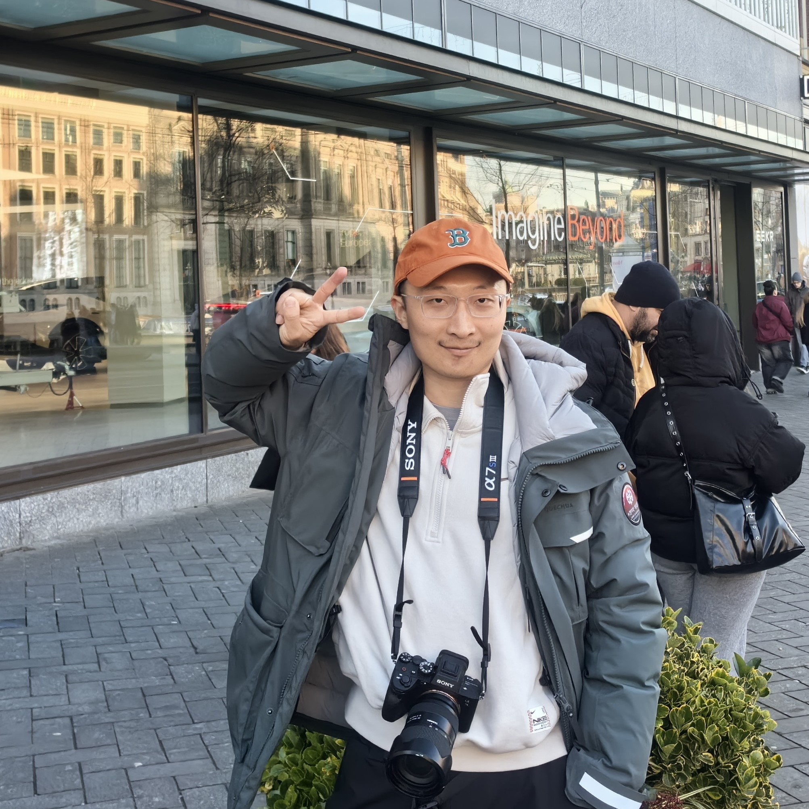
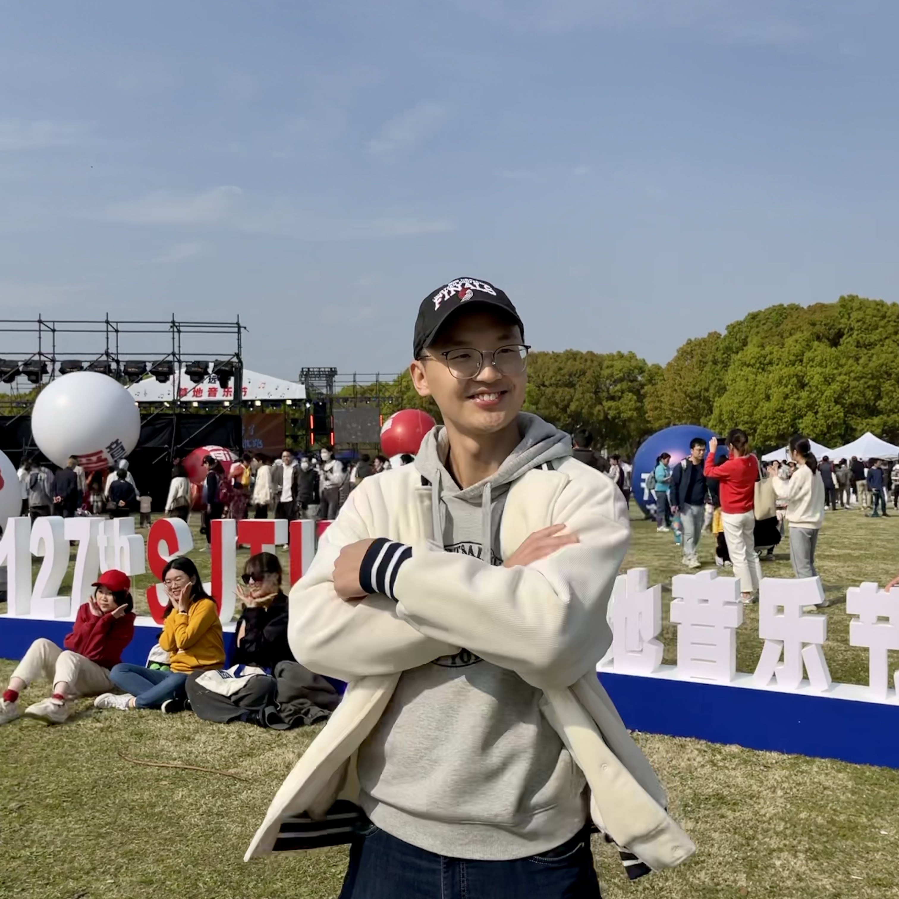
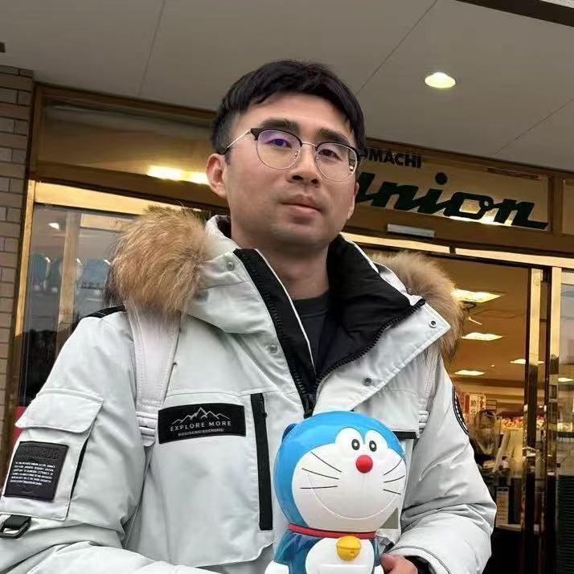
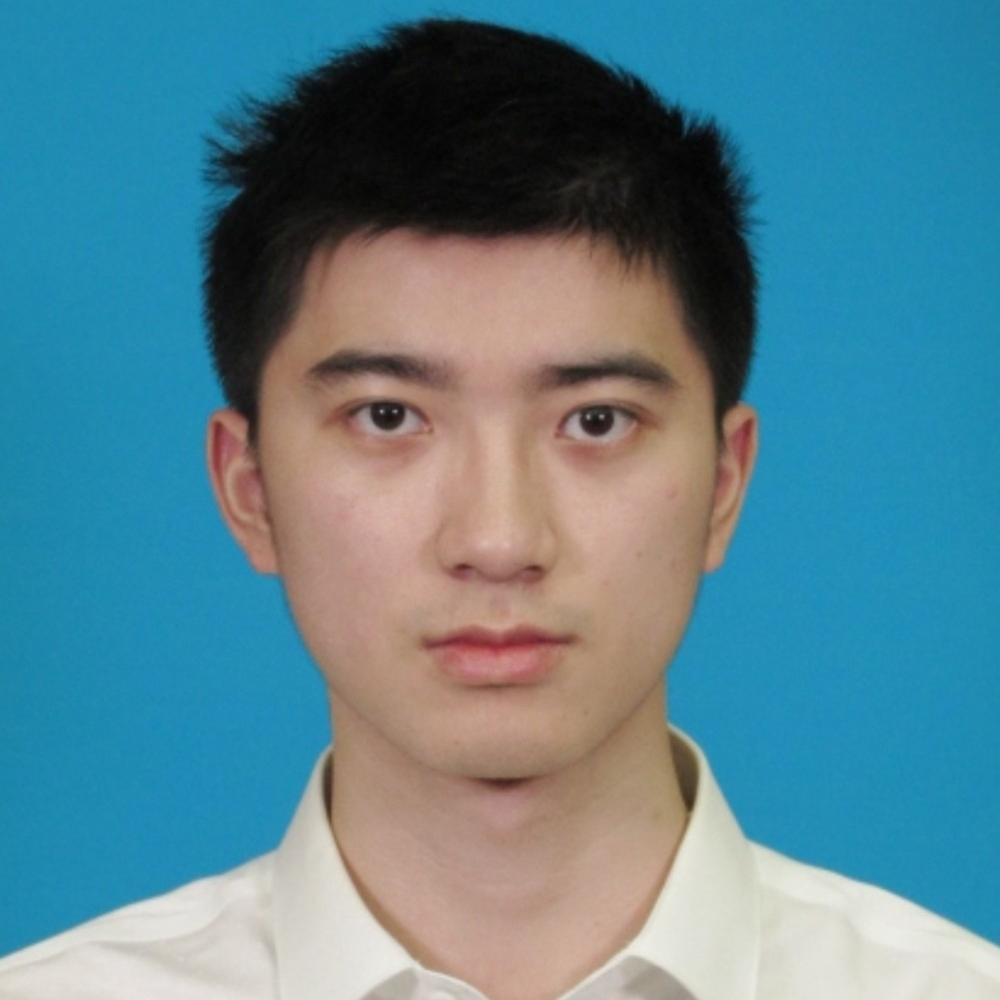
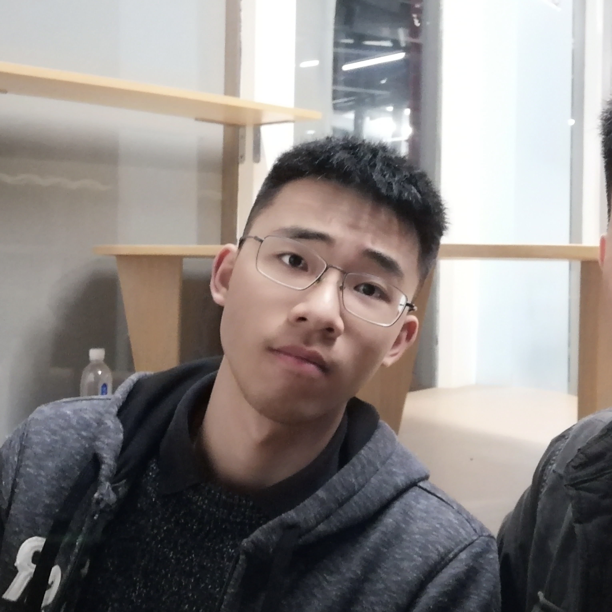

[//]: # (<h2> 博士后 </h2>)

        <figure align="center">
        
        <figcaption><b>许海南</b> <b>2-U</b></figcaption>
        </figure>
    

        <figure align="center">
        
        <figcaption><b>范雨晨</b> <b>3-U</b></figcaption>
        </figure>
    

        <figure align="center">
        
        <figcaption><b>刘媛</b> <b>4-M</b></figcaption>
        </figure>
    

        <figure align="center">
        
        <figcaption><b>项煦</b> <b>5-UM</b></figcaption>
        </figure>
    

        <figure align="center">
        
        <figcaption><b>孙睿骅</b> <b>6-M</b></figcaption>
        </figure>
    

        <figure align="center">
        
        <figcaption><b>邓威</b> <b>7-M</b></figcaption>
        </figure>
    

        <figure align="center">
        
        <figcaption><b>吴春阳</b> <b>8-U</b></figcaption>
        </figure>
    

        <figure align="center">
        
        <figcaption><b>游永彬</b> <b>9-UM</b></figcaption>
        </figure>
    

        <figure align="center">
        
        <figcaption><b>王佩璐</b> <b>10-IM</b></figcaption>
        </figure>
    

        <figure align="center">
        
        <figcaption><b>刘亚雄</b> <b>12-U</b></figcaption>
        </figure>
    

        <figure align="center">
        
        <figcaption><b>谭天</b> <b>14-UP</b></figcaption>
        </figure>
    

        <figure align="center">
        
        <figcaption><b>朱苏</b> <b>15-UP</b></figcaption>
        </figure>
    

        <figure align="center">
        
        <figcaption><b>谢国成</b> <b>16-U</b></figcaption>
        </figure>
    

        <figure align="center">
        
        <figcaption><b>贺天行</b> <b>17-UM</b></figcaption>
        </figure>
    

        <figure align="center">
        
        <figcaption><b>符天凡</b> <b>18-U</b></figcaption>
        </figure>
    

        <figure align="center">
        
        <figcaption><b>陈博</b> <b>19-P</b></figcaption>
        </figure>
    

        <figure align="center">
        
        <figcaption><b>孙锴</b> <b>20-U</b></figcaption>
        </figure>
    

        <figure align="center">
        
        <figcaption><b>陈楠昕</b> <b>21-U</b></figcaption>
        </figure>
    

        <figure align="center">
        
        <figcaption><b>卜素亮</b> <b>22-I</b></figcaption>
        </figure>
    

        <figure align="center">
        
        <figcaption><b>童思博</b> <b>23-M</b></figcaption>
        </figure>
    

        <figure align="center">
        
        <figcaption><b>万一</b> <b>24-U</b></figcaption>
        </figure>
    

        <figure align="center">
        
        <figcaption><b>郑达</b> <b>25-UM</b></figcaption>
        </figure>
    

        <figure align="center">
        
        <figcaption><b>陈哲怀</b> <b>26-UP</b></figcaption>
        </figure>
    

        <figure align="center">
        
        <figcaption><b>Heinrich（丁翰林）</b> <b>27-MP</b></figcaption>
        </figure>
    

        <figure align="center">
        
        <figcaption><b>毕梦霄</b> <b>28-M</b></figcaption>
        </figure>
    

        <figure align="center">
        
        <figcaption><b>慎力博</b> <b>29-U</b></figcaption>
        </figure>
    

        <figure align="center">
        
        <figcaption><b>常烜恺</b> <b>30-UM</b></figcaption>
        </figure>
    

        <figure align="center">
        
        <figcaption><b>葛凌廷</b> <b>31-U</b></figcaption>
        </figure>
    

        <figure align="center">
        
        <figcaption><b>顾昊</b> <b>32-U</b></figcaption>
        </figure>
    

        <figure align="center">
        
        <figcaption><b>黎幸东</b> <b>33-U</b></figcaption>
        </figure>
    

        <figure align="center">
        
        <figcaption><b>金汶功</b> <b>34-U</b></figcaption>
        </figure>
    

        <figure align="center">
        
        <figcaption><b>谢其哲</b> <b>35-U</b></figcaption>
        </figure>
    

        <figure align="center">
        
        <figcaption><b>尹茂帆</b> <b>36-U</b></figcaption>
        </figure>
    

        <figure align="center">
        
        <figcaption><b>姜孝伟</b> <b>37-UM</b></figcaption>
        </figure>
    

        <figure align="center">
        
        <figcaption><b>庄毅萌</b> <b>38-M</b></figcaption>
        </figure>
    

        <figure align="center">
        
        <figcaption><b>常成</b> <b>39-UM</b></figcaption>
        </figure>
    

        <figure align="center">
        
        <figcaption><b>曹迪</b> <b>40-UM</b></figcaption>
        </figure>
    

        <figure align="center">
        
        <figcaption><b>徐佳琛</b> <b>41-U</b></figcaption>
        </figure>
    

        <figure align="center">
        
        <figcaption><b>王帅</b> <b>42-P</b></figcaption>
        </figure>
    

        <figure align="center">
        
        <figcaption><b>刘奇</b> <b>43-P</b></figcaption>
        </figure>
    

        <figure align="center">
        
        <figcaption><b>吴科</b> <b>44-F</b></figcaption>
        </figure>
    

        <figure align="center">
        
        <figcaption><b>吴越</b> <b>45-UM</b></figcaption>
        </figure>
    

        <figure align="center">
        
        <figcaption><b>吴学阳</b> <b>46-UP</b></figcaption>
        </figure>
    

        <figure align="center">
        
        <figcaption><b>刘轩</b> <b>47-M</b></figcaption>
        </figure>
    

        <figure align="center">
        
        <figcaption><b>胡云聪</b> <b>48-UP</b></figcaption>
        </figure>
    

        <figure align="center">
        
        <figcaption><b>李翰正</b> <b>49-U</b></figcaption>
        </figure>
    

        <figure align="center">
        
        <figcaption><b>姚思秋</b> <b>50-U</b></figcaption>
        </figure>
    

        <figure align="center">
        
        <figcaption><b>高剑飞</b> <b>51-U</b></figcaption>
        </figure>
    

        <figure align="center">
        
        <figcaption><b>赖家豪</b> <b>52-M</b></figcaption>
        </figure>
    

        <figure align="center">
        
        <figcaption><b>陈瑞年</b> <b>53-UM</b></figcaption>
        </figure>
    

        <figure align="center">
        
        <figcaption><b>丁文</b> <b>54-UM</b></figcaption>
        </figure>
    

        <figure align="center">
        
        <figcaption><b>周瑛</b> <b>55-UM</b></figcaption>
        </figure>
    

        <figure align="center">
        
        <figcaption><b>石开宇</b> <b>56-UM</b></figcaption>
        </figure>
    

        <figure align="center">
        
        <figcaption><b>杨闰哲</b> <b>57-U</b></figcaption>
        </figure>
    

        <figure align="center">
        
        <figcaption><b>叶子豪</b> <b>58-U</b></figcaption>
        </figure>
    

        <figure align="center">
        
        <figcaption><b>张慧峰</b> <b>59-M</b></figcaption>
        </figure>
    

        <figure align="center">
        
        <figcaption><b>周翔</b> <b>60-U</b></figcaption>
        </figure>
    

        <figure align="center">
        
        <figcaption><b>林弘韬</b> <b>61-U</b></figcaption>
        </figure>
    

        <figure align="center">
        
        <figcaption><b>杨叶新</b> <b>62-UM</b></figcaption>
        </figure>
    

        <figure align="center">
        
        <figcaption><b>胡虎</b> <b>63-U</b></figcaption>
        </figure>
    

        <figure align="center">
        
        <figcaption><b>陈烨斐</b> <b>64-M</b></figcaption>
        </figure>
    

        <figure align="center">
        
        <figcaption><b>李豪</b> <b>65-M</b></figcaption>
        </figure>
    

        <figure align="center">
        
        <figcaption><b>赵子健</b> <b>66-M</b></figcaption>
        </figure>
    

        <figure align="center">
        
        <figcaption><b>殷国航</b> <b>67-U</b></figcaption>
        </figure>
    

        <figure align="center">
        
        <figcaption><b>陈志</b> <b>68-UP</b></figcaption>
        </figure>
    

        <figure align="center">
        
        <figcaption><b>陈宽</b> <b>69-UM</b></figcaption>
        </figure>
    

        <figure align="center">
        
        <figcaption><b>黄明坤</b> <b>70-M</b></figcaption>
        </figure>
    

        <figure align="center">
        
        <figcaption><b>郭嘉祺</b> <b>71-M</b></figcaption>
        </figure>
    

        <figure align="center">
        
        <figcaption><b>吴松泽</b> <b>72-M</b></figcaption>
        </figure>
    

        <figure align="center">
        
        <figcaption><b>兰鸥羽</b> <b>74-U</b></figcaption>
        </figure>
    

        <figure align="center">
        
        <figcaption><b>黄子砾</b> <b>75-U</b></figcaption>
        </figure>
    

        <figure align="center">
        
        <figcaption><b>刘辰</b> <b>76-M</b></figcaption>
        </figure>
    

        <figure align="center">
        
        <figcaption><b>张王优</b> <b>77-P</b></figcaption>
        </figure>
    

        <figure align="center">
        
        <figcaption><b>杜晨鹏</b> <b>78-P</b></figcaption>
        </figure>
    

        <figure align="center">
        
        <figcaption><b>马娆</b> <b>79-M</b></figcaption>
        </figure>
    

        <figure align="center">
        
        <figcaption><b>李晨达</b> <b>80-M</b></figcaption>
        </figure>
    

        <figure align="center">
        
        <figcaption><b>卢怡宙</b> <b>81-M</b></figcaption>
        </figure>
    

        <figure align="center">
        
        <figcaption><b>赵晏彬</b> <b>82-M</b></figcaption>
        </figure>
    

        <figure align="center">
        
        <figcaption><b>徐志航</b> <b>83-M</b></figcaption>
        </figure>
    

        <figure align="center">
        
        <figcaption><b>王鸿基</b> <b>85-M</b></figcaption>
        </figure>
    

        <figure align="center">
        
        <figcaption><b>谢凯歌</b> <b>86-U</b></figcaption>
        </figure>
    

        <figure align="center">
        
        <figcaption><b>盛佩瑶</b> <b>87-U</b></figcaption>
        </figure>
    

        <figure align="center">
        
        <figcaption><b>龙思杉</b> <b>88-U</b></figcaption>
        </figure>
    

        <figure align="center">
        
        <figcaption><b>杨卓林</b> <b>89-U</b></figcaption>
        </figure>
    

        <figure align="center">
        
        <figcaption><b>陈正阳</b> <b>90-P</b></figcaption>
        </figure>
    

        <figure align="center">
        
        <figcaption><b>李杰宇</b> <b>92-UM</b></figcaption>
        </figure>
    

        <figure align="center">
        
        <figcaption><b>陈星宇</b> <b>93-M</b></figcaption>
        </figure>
    

        <figure align="center">
        
        <figcaption><b>吕波尔</b> <b>95-M</b></figcaption>
        </figure>
    

        <figure align="center">
        
        <figcaption><b>谭博文</b> <b>96-U</b></figcaption>
        </figure>
    

        <figure align="center">
        
        <figcaption><b>赵耀</b> <b>97-M</b></figcaption>
        </figure>
    

        <figure align="center">
        
        <figcaption><b>周之恺</b> <b>99-M</b></figcaption>
        </figure>
    

        <figure align="center">
        
        <figcaption><b>王巍</b> <b>100-M</b></figcaption>
        </figure>
    

        <figure align="center">
        
        <figcaption><b>吴章昊</b> <b>101-U</b></figcaption>
        </figure>
    

        <figure align="center">
        
        <figcaption><b>王天哲</b> <b>102-U</b></figcaption>
        </figure>
    

        <figure align="center">
        
        <figcaption><b>刘知峻</b> <b>103-UM</b></figcaption>
        </figure>
    

        <figure align="center">
        
        <figcaption><b>张平越</b> <b>104-U</b></figcaption>
        </figure>
    

        <figure align="center">
        
        <figcaption><b>徐子涵</b> <b>105-U</b></figcaption>
        </figure>
    

        <figure align="center">
        
        <figcaption><b>吴逸飞</b> <b>108-M</b></figcaption>
        </figure>
    

        <figure align="center">
        
        <figcaption><b>韩冰</b> <b>109-M</b></figcaption>
        </figure>
    

        <figure align="center">
        
        <figcaption><b>李光伟</b> <b>110-M</b></figcaption>
        </figure>
    

        <figure align="center">
        
        <figcaption><b>戴凌锋</b> <b>111-M</b></figcaption>
        </figure>
    

        <figure align="center">
        
        <figcaption><b>姜飞</b> <b>114-F</b></figcaption>
        </figure>
    

        <figure align="center">
        
        <figcaption><b>杨溢</b> <b>115-P</b></figcaption>
        </figure>
    

        <figure align="center">
        
        <figcaption><b>胡巧平</b> <b>116-P</b></figcaption>
        </figure>
    

        <figure align="center">
        
        <figcaption><b>周华毅</b> <b>117-MP</b></figcaption>
        </figure>
    

        <figure align="center">
        
        <figcaption><b>司家鑫</b> <b>118-P</b></figcaption>
        </figure>
    

        <figure align="center">
        
        <figcaption><b>肖翔</b> <b>119-M</b></figcaption>
        </figure>
    

        <figure align="center">
        
        <figcaption><b>李泽达</b> <b>120-M</b></figcaption>
        </figure>
    

        <figure align="center">
        
        <figcaption><b>余天</b> <b>121-M</b></figcaption>
        </figure>
    

        <figure align="center">
        
        <figcaption><b>伍彦蓉</b> <b>122-M</b></figcaption>
        </figure>
    

        <figure align="center">
        
        <figcaption><b>杨浩泽</b> <b>123-M</b></figcaption>
        </figure>
    

        <figure align="center">
        
        <figcaption><b>陈继森</b> <b>124-M</b></figcaption>
        </figure>
    

        <figure align="center">
        
        <figcaption><b>江文斌</b> <b>125-F</b></figcaption>
        </figure>
    

        <figure align="center">
        
        <figcaption><b>梁正</b> <b>126-M</b></figcaption>
        </figure>
    

        <figure align="center">
        
        <figcaption><b>余林峰</b> <b>127-M</b></figcaption>
        </figure>
    

        <figure align="center">
        
        <figcaption><b>邵航</b> <b>128-M</b></figcaption>
        </figure>
    

        <figure align="center">
        
        <figcaption><b>龚勋</b> <b>130-P</b></figcaption>
        </figure>
    

        <figure align="center">
        
        <figcaption><b>李春晖</b> <b>132-M</b></figcaption>
        </figure>
    

        <figure align="center">
        
        <figcaption><b>刘韫聪</b> <b>133-P</b></figcaption>
        </figure>
    

        <figure align="center">
        
        <figcaption><b>刘森</b> <b>134-M</b></figcaption>
        </figure>
    

        <figure align="center">
        
        <figcaption><b>李广鹏</b> <b>135-M</b></figcaption>
        </figure>
    

        <figure align="center">
        
        <figcaption><b>杨宝琛</b> <b>136-M</b></figcaption>
        </figure>
    

        <figure align="center">
        
        <figcaption><b>谢泽宇</b> <b>138-U</b></figcaption>
        </figure>
    

        <figure align="center">
        
        <figcaption><b>陈思远</b> <b>149-M</b></figcaption>
        </figure>
    

        <figure align="center">
        
        <figcaption><b>宋哲书</b> <b>154-M</b></figcaption>
        </figure>
    

        <figure align="center">
        
        <figcaption><b>张淳皓</b> <b>155-M</b></figcaption>
        </figure>
    

        <figure align="center">
        
        <figcaption><b>张晗翀</b> <b>165-M</b></figcaption>
        </figure>
    

        <figure align="center">
        
        <figcaption><b>黎井漂</b> <b>168-M</b></figcaption>
        </figure>
    

        <figure align="center">
        
        <figcaption><b>孙良泰</b> <b>170-M</b></figcaption>
        </figure>
    

        <figure align="center">
        
        <figcaption><b>何朝帆</b> <b>172-M</b></figcaption>
        </figure>
    

        <figure align="center">
        
        <figcaption><b>曾泓川</b> <b>176-M</b></figcaption>
        </figure>
    

        <figure align="center">
        
        <figcaption><b>曾泓川</b> <b>176-M</b></figcaption>
        </figure>
    

        <figure align="center">
        
        <figcaption><b>沈飞宇</b> <b>179-M</b></figcaption>
        </figure>
    

        <figure align="center">
        
        <figcaption><b>骆翱</b> <b>180-U</b></figcaption>
        </figure>
    

        <figure align="center">
        
        <figcaption><b>计家宝</b> <b>181-U</b></figcaption>
        </figure>
    

        <figure align="center">
        
        <figcaption><b>林少雄</b> <b>182-M</b></figcaption>
        </figure>
    
