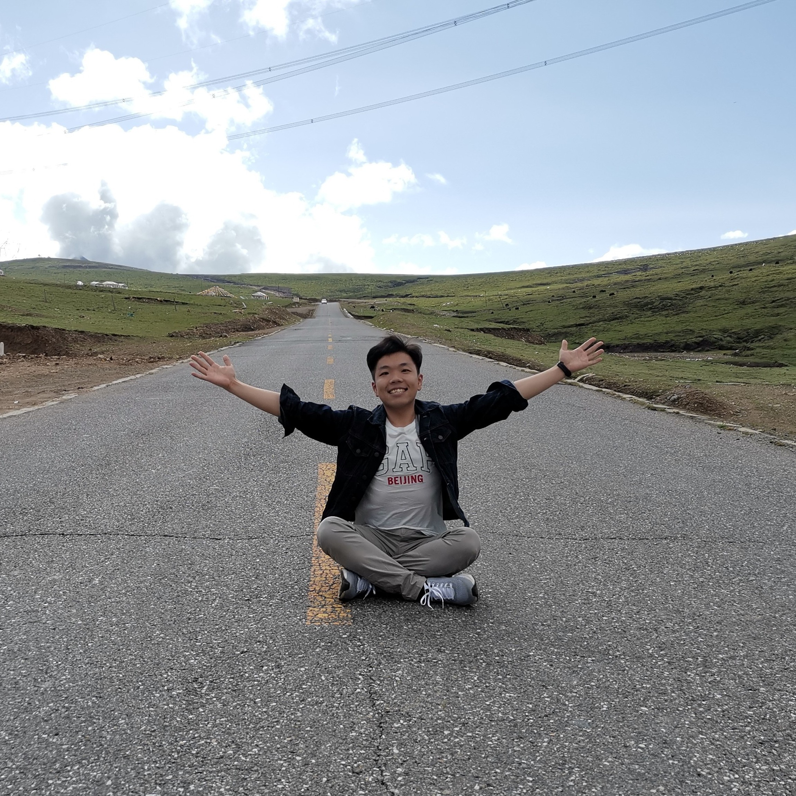
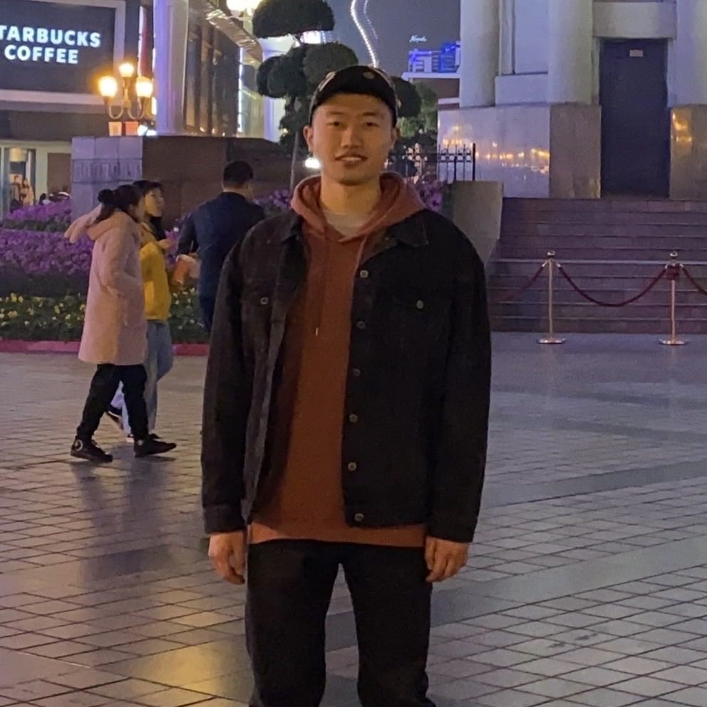
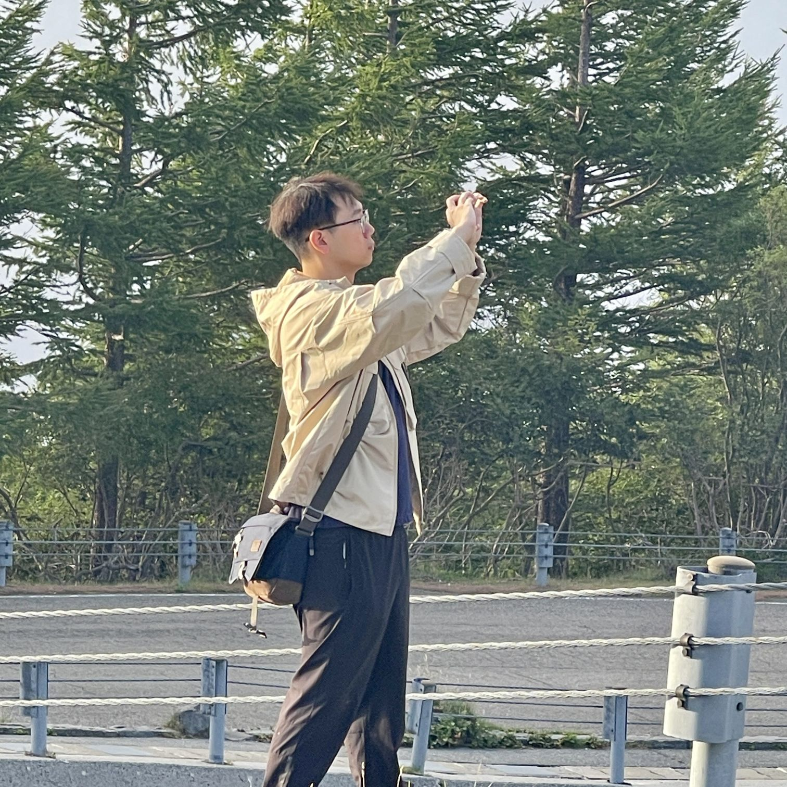
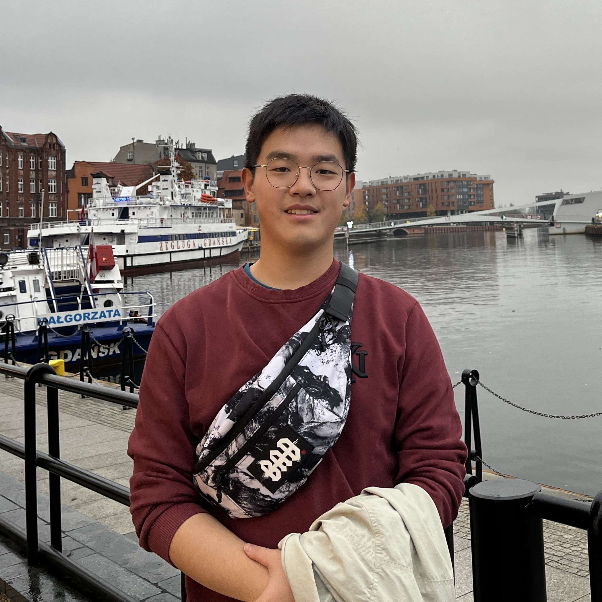
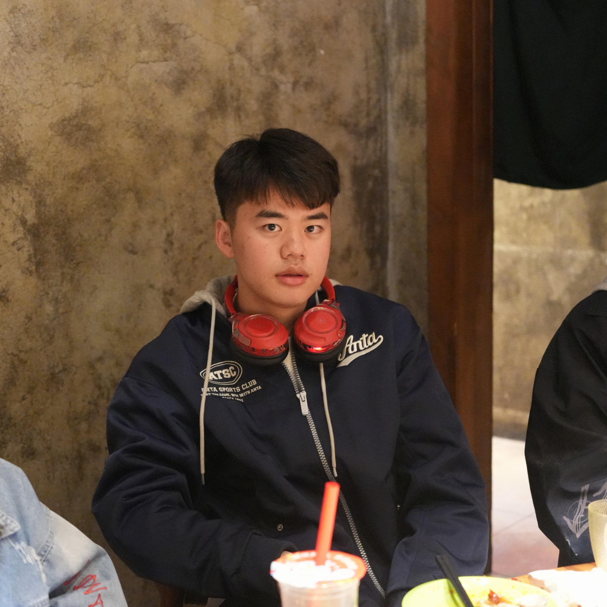
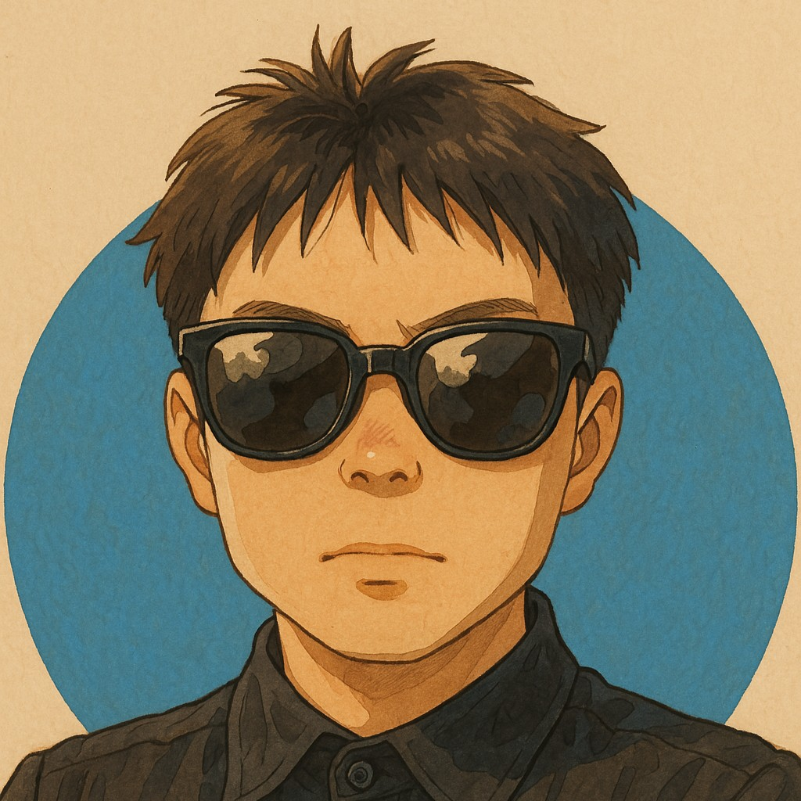
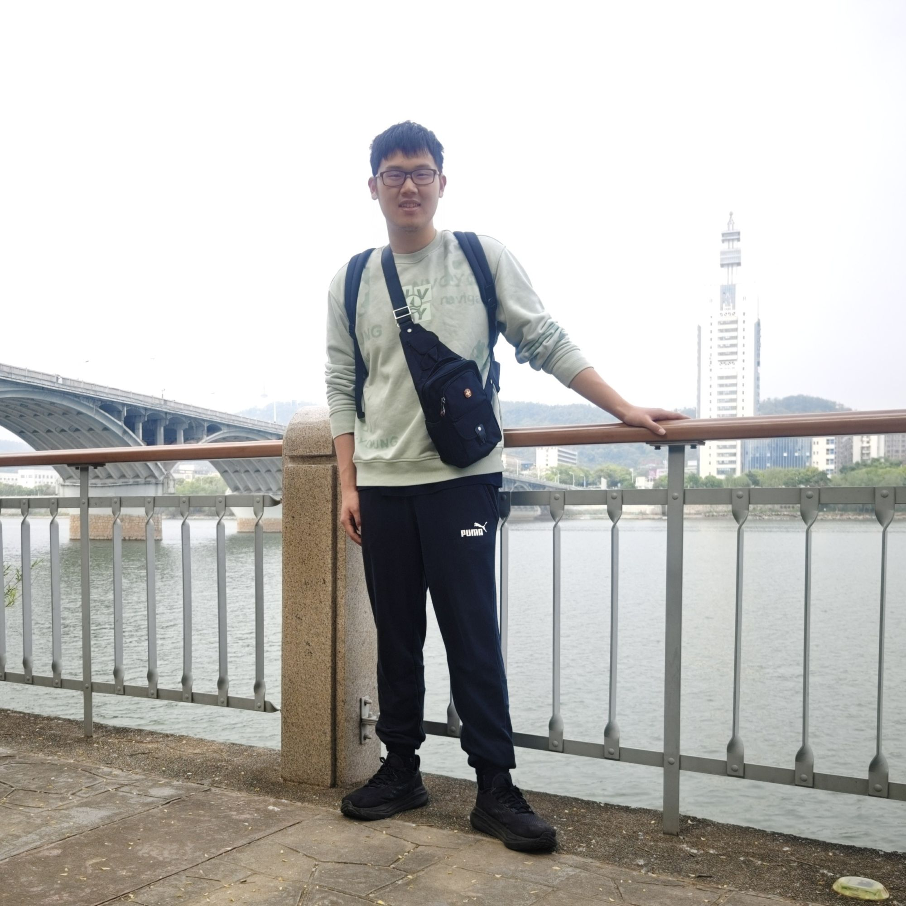

[//]: # (<h2> 博士后 </h2>)

<h2> 博士研究生 </h2>

        <figure align="center">
        
        <figcaption><b>许洪深</b> <b>091-P</b></figcaption>
        </figure>
    

        <figure align="center">
        
        <figcaption><b>陈星宇</b> <b>093-MP</b></figcaption>
        </figure>
    

        <figure align="center">
        
        <figcaption><b>马达</b> <b>094-MP</b></figcaption>
        </figure>
    

        <figure align="center">
        
        <figcaption><b>徐薛楠</b> <b>098-MP</b></figcaption>
        </figure>
    

        <figure align="center">
        
        <figcaption><b>赵梓涵</b> <b>106-P</b></figcaption>
        </figure>
    

        <figure align="center">
        
        <figcaption><b>奚彧</b> <b>107-P</b></figcaption>
        </figure>
    

        <figure align="center">
        
        <figcaption><b>张丹阳</b> <b>112-P</b></figcaption>
        </figure>
    

        <figure align="center">
        
        <figcaption><b>刘涛</b> <b>129-P</b></figcaption>
        </figure>
    

        <figure align="center">
        
        <figcaption><b>兰焜耀</b> <b>131-MP</b></figcaption>
        </figure>
    

        <figure align="center">
        
        <figcaption><b>张思拓</b> <b>140-P</b></figcaption>
        </figure>
    

        <figure align="center">
        
        <figcaption><b>王鹏宇</b> <b>145-P</b></figcaption>
        </figure>
    

        <figure align="center">
        
        <figcaption><b>朱梓臣</b> <b>146-UP</b></figcaption>
        </figure>
    

        <figure align="center">
        
        <figcaption><b>罗嘉鸣</b> <b>147-P</b></figcaption>
        </figure>
    

        <figure align="center">
        
        <figcaption><b>王翰坤</b> <b>150-P</b></figcaption>
        </figure>
    

        <figure align="center">
        
        <figcaption><b>马子阳</b> <b>151-P</b></figcaption>
        </figure>
    

        <figure align="center">
        
        <figcaption><b>杨冠柔</b> <b>153-MP</b></figcaption>
        </figure>
    

        <figure align="center">
        
        <figcaption><b>郭奕玮</b> <b>158-P</b></figcaption>
        </figure>
    

        <figure align="center">
        
        <figcaption><b>刘浚哲</b> <b>160-P</b></figcaption>
        </figure>
    

        <figure align="center">
        
        <figcaption><b>宋秀杰</b> <b>164-P</b></figcaption>
        </figure>
    

        <figure align="center">
        
        <figcaption><b>韩杨</b> <b>166-P</b></figcaption>
        </figure>
    

        <figure align="center">
        
        <figcaption><b>杨亦凡</b> <b>171-P</b></figcaption>
        </figure>
    

        <figure align="center">
        
        <figcaption><b>牛志康</b> <b>177-UP</b></figcaption>
        </figure>
    

        <figure align="center">
        
        <figcaption><b>周强</b> <b>183-P</b></figcaption>
        </figure>
    

        <figure align="center">
        
        <figcaption><b>陈博</b> <b>190-P</b></figcaption>
        </figure>
    

<h2> 硕士研究生 </h2>

        <figure align="center">
        
        <figcaption><b>赵子健</b> <b>066-M</b></figcaption>
        </figure>
    

        <figure align="center">
        
        <figcaption><b>徐晓航</b> <b>139-M</b></figcaption>
        </figure>
    

        <figure align="center">
        
        <figcaption><b>卢葛威</b> <b>143-M</b></figcaption>
        </figure>
    

        <figure align="center">
        
        <figcaption><b>罗丹宇</b> <b>144-UM</b></figcaption>
        </figure>
    

        <figure align="center">
        
        <figcaption><b>卓建衡</b> <b>148-M</b></figcaption>
        </figure>
    

        <figure align="center">
        
        <figcaption><b>李俊杰</b> <b>152-M</b></figcaption>
        </figure>
    

        <figure align="center">
        
        <figcaption><b>金豪桉</b> <b>156-M</b></figcaption>
        </figure>
    

        <figure align="center">
        
        <figcaption><b>李浩宇</b> <b>159-M</b></figcaption>
        </figure>
    

        <figure align="center">
        
        <figcaption><b>张耀匀</b> <b>161-M</b></figcaption>
        </figure>
    

        <figure align="center">
        
        <figcaption><b>肖云冲</b> <b>162-M</b></figcaption>
        </figure>
    

        <figure align="center">
        
        <figcaption><b>吕铭浩</b> <b>163-M</b></figcaption>
        </figure>
    

        <figure align="center">
        
        <figcaption><b>韩森宇</b> <b>167-M</b></figcaption>
        </figure>
    

        <figure align="center">
        
        <figcaption><b>李翰奇</b> <b>169-M</b></figcaption>
        </figure>
    

        <figure align="center">
        
        <figcaption><b>杨飞</b> <b>173-M</b></figcaption>
        </figure>
    

        <figure align="center">
        
        <figcaption><b>宋雅昆</b> <b>174-M</b></figcaption>
        </figure>
    

        <figure align="center">
        
        <figcaption><b>李星源</b> <b>175-M</b></figcaption>
        </figure>
    

        <figure align="center">
        
        <figcaption><b>赵宇翔</b> <b>178-M</b></figcaption>
        </figure>
    

        <figure align="center">
        
        <figcaption><b>王浩然</b> <b>186-UM</b></figcaption>
        </figure>
    

        <figure align="center">
        
        <figcaption><b>罗逸杰</b> <b>187-M</b></figcaption>
        </figure>
    

        <figure align="center">
        
        <figcaption><b>刘丁烨</b> <b>189-M</b></figcaption>
        </figure>
    

        <figure align="center">
        
        <figcaption><b>周鼎</b> <b>197-UM</b></figcaption>
        </figure>
    

        <figure align="center">
        
        <figcaption><b>黄甘雨</b> <b></b></figcaption>
        </figure>
    

        <figure align="center">
        
        <figcaption><b>陈禹伸</b> <b></b></figcaption>
        </figure>
    

        <figure align="center">
        
        <figcaption><b>彭阅章</b> <b></b></figcaption>
        </figure>
    

        <figure align="center">
        
        <figcaption><b>郑航</b> <b></b></figcaption>
        </figure>
    

<h2> 本科生 </h2>

        <figure align="center">
        
        <figcaption><b>杨晨</b> <b>141-U</b></figcaption>
        </figure>
    

        <figure align="center">
        
        <figcaption><b>陈琦</b> <b>142-U</b></figcaption>
        </figure>
    

        <figure align="center">
        
        <figcaption><b>李柏涵</b> <b>157-U</b></figcaption>
        </figure>
    

        <figure align="center">
        
        <figcaption><b>樊帅</b> <b>185-F</b></figcaption>
        </figure>
    

        <figure align="center">
        
        <figcaption><b>王辰润</b> <b>192-U</b></figcaption>
        </figure>
    

        <figure align="center">
        
        <figcaption><b>万恬溪</b> <b>193-U</b></figcaption>
        </figure>
    

        <figure align="center">
        
        <figcaption><b>靳秉睿</b> <b>194-U</b></figcaption>
        </figure>
    

        <figure align="center">
        
        <figcaption><b>文雯</b> <b>195-U</b></figcaption>
        </figure>
    

        <figure align="center">
        
        <figcaption><b>郑之胜</b> <b>196-U</b></figcaption>
        </figure>
    

        <figure align="center">
        
        <figcaption><b>李波含</b> <b>200-U</b></figcaption>
        </figure>
    

        <figure align="center">
        
        <figcaption><b>张杭磊</b> <b></b></figcaption>
        </figure>
    

        <figure align="center">
        
        <figcaption><b>张熙灼</b> <b></b></figcaption>
        </figure>
    

        <figure align="center">
        
        <figcaption><b>陈宝才</b> <b></b></figcaption>
        </figure>
    

        <figure align="center">
        
        <figcaption><b>申振南</b> <b></b></figcaption>
        </figure>
    

        <figure align="center">
        
        <figcaption><b>张耀中</b> <b></b></figcaption>
        </figure>
    

        <figure align="center">
        
        <figcaption><b>陈文熙</b> <b></b></figcaption>
        </figure>
    

        <figure align="center">
        
        <figcaption><b>朱彦桥</b> <b></b></figcaption>
        </figure>
    

        <figure align="center">
        
        <figcaption><b>郑棋曦</b> <b></b></figcaption>
        </figure>
    

        <figure align="center">
        
        <figcaption><b>刘轩丞</b> <b></b></figcaption>
        </figure>
    

        <figure align="center">
        
        <figcaption><b>梁宇哲</b> <b></b></figcaption>
        </figure>
    

        <figure align="center">
        
        <figcaption><b>陈逸恒</b> <b></b></figcaption>
        </figure>
    

        <figure align="center">
        
        <figcaption><b>李希泉 </b> <b></b></figcaption>
        </figure>
    

        <figure align="center">
        
        <figcaption><b>舒欣茗</b> <b></b></figcaption>
        </figure>
    

        <figure align="center">
        
        <figcaption><b>姜皓翔</b> <b></b></figcaption>
        </figure>
    

        <figure align="center">
        
        <figcaption><b>徐瑞阳</b> <b></b></figcaption>
        </figure>
    

        <figure align="center">
        
        <figcaption><b>张一凡</b> <b></b></figcaption>
        </figure>
    

        <figure align="center">
        
        <figcaption><b>郭思佳</b> <b></b></figcaption>
        </figure>
    

        <figure align="center">
        
        <figcaption><b>黄天呈</b> <b></b></figcaption>
        </figure>
    

        <figure align="center">
        
        <figcaption><b>彭景</b> <b></b></figcaption>
        </figure>
    

        <figure align="center">
        
        <figcaption><b>杨子越</b> <b></b></figcaption>
        </figure>
    

        <figure align="center">
        
        <figcaption><b>谢睿</b> <b></b></figcaption>
        </figure>
    

        <figure align="center">
        
        <figcaption><b>曹义路</b> <b></b></figcaption>
        </figure>
    

        <figure align="center">
        
        <figcaption><b>苗语洵</b> <b></b></figcaption>
        </figure>
    

        <figure align="center">
        
        <figcaption><b>李贻瑄</b> <b></b></figcaption>
        </figure>
    

        <figure align="center">
        
        <figcaption><b>汪子翔</b> <b></b></figcaption>
        </figure>
    

        <figure align="center">
        
        <figcaption><b>孙羽恒</b> <b></b></figcaption>
        </figure>
    

        <figure align="center">
        
        <figcaption><b>冯草林</b> <b></b></figcaption>
        </figure>
    

        <figure align="center">
        
        <figcaption><b>单奕佳</b> <b></b></figcaption>
        </figure>
    

        <figure align="center">
        
        <figcaption><b>陶也</b> <b></b></figcaption>
        </figure>
    

        <figure align="center">
        
        <figcaption><b>迟佳颖</b> <b></b></figcaption>
        </figure>
    

